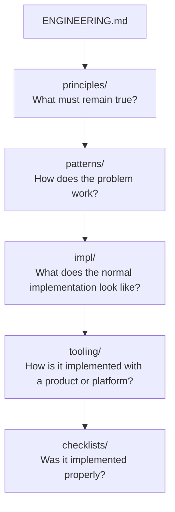

# Implementation References

Use this directory when you know the engineering activity and need its normal operating shape before reading the deeper doctrine or choosing a product.

> **`impl/` — implementation-neutral reference implementations. These documents compose canonical principles and patterns into simple engineer-facing operating models. They MAY simplify, visualise, and route existing doctrine, but MUST NOT create new normative requirements. Canonical principles and owning patterns remain authoritative on conflict.**

If an implementation reference conflicts with a canonical principle or owning pattern, the canonical owner wins and the implementation reference is defective.

## Place In The Library



Supporting evidence and history remain under `evolution/`; decisions about this library remain under `docs/adr/`.

## Authority Boundary

An implementation reference may:

- simplify and compose existing doctrine;
- show a normal flow, state model, or small decision table;
- expose common variations and applicability boundaries; and
- route readers to canonical doctrine, tooling mappings, and verification checklists.

It must not invent an obligation. If the normal shape needs a requirement that no canonical owner states, either add that requirement through the doctrine change harness first or label the implementation choice explicitly non-normative.

Implementation references do not replace the nuance, trade-offs, failure modes, or applicability rules in patterns. They do not contain vendor mappings, and they do not turn verification prompts into authority.

## Candidate Test

Consider a new implementation reference when all of these are true:

1. The subject is a common engineering activity.
2. A reader currently needs three or more canonical files to reconstruct its normal shape.
3. A useful flow, lifecycle, state model, or compact composition exists.
4. The composition can be written without creating or strengthening requirements.
5. An engineer would plausibly use it during delivery work.

If the subject is owned adequately by one principle or pattern, link to that owner instead of adding a thin reference.

## Normal Document Shape

Most references should be roughly 500–1,500 words and optimised for a two-to-five-minute read:

```text
# <Activity>

## Use when
## Standard shape
## Invariants
## Normal implementation
## Common variations
## Boundaries
## Canonical doctrine
```

The final section always identifies the principles and patterns being composed, plus relevant tooling and checklists. Longer references need a genuine implementation reason; research, duplicated rationale, exhaustive product matrices, and embedded mega-checklists belong elsewhere.

## Available References

- [CI/CD Delivery](cicd-delivery.md) — branch-to-production flow, candidate identity, promotion, verification, and delivery-unit variations.

Proposed future references are screened in [the implementation-reference research note](../evolution/research-implementation-reference-layer-2026-09.md#screened-backlog); they are not adopted merely by appearing in that backlog.

## Canonical Doctrine

- [How To Read This Doctrine](../patterns/how-to-read-this-doctrine.md) — authority order, reading paths, and conflict handling.
- [Timeless Principles, Reference Implementations, And Replaceable Tooling](../principles/timeless-principles-and-tooling.md) — durable intent, composition references, and replaceable tooling.
- [Doctrine Library Change Harness](../patterns/doctrine-library-change-harness.md) — required process for adding or materially changing a reference.
- [ADR 0048](../../docs/adr/0048-add-implementation-reference-layer.md) — decision to introduce this layer and its authority boundary.
- [Implementation Reference Layer Research](../evolution/research-implementation-reference-layer-2026-09.md) — repository evidence, CI/CD exemplar audit, and screened backlog.
