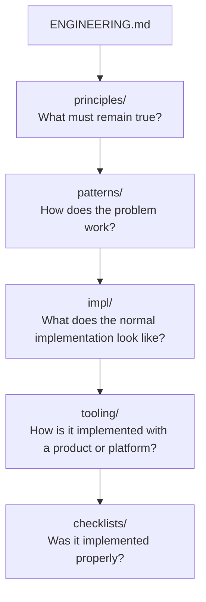

# Implementation References

Use this directory when you know the engineering activity and need its normal operating shape before reading the deeper doctrine or choosing a product.

> **`impl/` — implementation-neutral reference implementations. These documents compose canonical principles and patterns into simple engineer-facing operating models. They MAY simplify, visualise, and route existing doctrine, but MUST NOT create new normative requirements. Canonical principles and owning patterns remain authoritative on conflict.**

If an implementation reference conflicts with a canonical principle or owning pattern, the canonical owner wins and the implementation reference is defective.

Think of an implementation reference as a **compiled view of doctrine**. Principles and patterns are the source semantics; `impl/` selects, composes, and simplifies them for use. A compiled view may improve usability, but it cannot invent semantics or become the source of an obligation.

## Place In The Library



Supporting evidence and history remain under `evolution/`; decisions about this library remain under `docs/adr/`.

## Authority Boundary

An implementation reference may:

- simplify and compose existing doctrine;
- show a normal flow, state model, or small decision table;
- expose common variations and applicability boundaries; and
- route readers to canonical doctrine, tooling mappings, and verification checklists.

It must not invent an obligation. If the normal shape needs a requirement that no canonical owner states, either add that requirement through the doctrine change harness first or label the implementation choice explicitly non-normative.

Implementation references do not replace the nuance, trade-offs, failure modes, or applicability rules in patterns. They do not contain vendor mappings, and they do not turn verification prompts into authority.

## Contract Tests

Use these tests before adding or materially expanding a reference:

1. **Activity test:** it describes something engineers do and answers a practical question. Name the file for that activity rather than a broad subject area.
2. **Compression test:** it saves the reader from reconstructing one operating model from several canonical owners. If one canonical file already provides the same model, link to it instead.
3. **No-new-doctrine test:** deleting the reference would remove no engineering obligation. If an obligation disappears, the reference accidentally became authoritative.
4. **Traceability test:** every material invariant maps to a named canonical principle or owning pattern.
5. **Variation test:** the normal shape remains product-neutral and preserves legitimate alternatives, applicability conditions, and boundaries.
6. **Usefulness test:** after a short read, a competent engineer knows the normal sequence, meaningful variations, expected evidence, and where to go deeper.

A useful flow, lifecycle, state model, evidence chain, or compact decision shape is normally the compression mechanism. Review every substantial section by asking whether it is implementation composition or content that belongs in a principle, pattern, tooling guide, checklist, or research note.

## Normal Document Shape

Most references should be roughly 500–1,500 words and optimised for a two-to-five-minute read:

```text
# <Activity>

## Use when
## Standard shape
## Invariants
## Normal implementation
## Common variations
## Boundaries
## Canonical doctrine
```

The final section always identifies the principles and patterns being composed, plus relevant tooling and checklists. Longer references need a genuine implementation reason and should not become exemplars for future size. Research, duplicated rationale, specialist mini-guides, exhaustive product matrices, and embedded mega-checklists belong elsewhere.

## Available References

- [CI/CD Delivery](cicd-delivery.md) — branch-to-production flow, candidate identity, promotion, verification, and delivery-unit variations.
- [Testing And Verification](testing-and-verification.md) — evidence placement across application CI, packages, deployments, infrastructure, migrations, and scheduled assurance.

Proposed future references are screened in [the implementation-reference research note](../evolution/research-implementation-reference-layer-2026-09.md#screened-backlog); they are not adopted merely by appearing in that backlog.

## Canonical Doctrine

- [How To Read This Doctrine](../patterns/how-to-read-this-doctrine.md) — authority order, reading paths, and conflict handling.
- [Timeless Principles, Reference Implementations, And Replaceable Tooling](../principles/timeless-principles-and-tooling.md) — durable intent, composition references, and replaceable tooling.
- [Doctrine Library Change Harness](../patterns/doctrine-library-change-harness.md) — required process for adding or materially changing a reference.
- [ADR 0048](../../docs/adr/0048-add-implementation-reference-layer.md) — decision to introduce this layer and its authority boundary.
- [Implementation Reference Layer Research](../evolution/research-implementation-reference-layer-2026-09.md) — repository evidence, CI/CD exemplar audit, and screened backlog.
