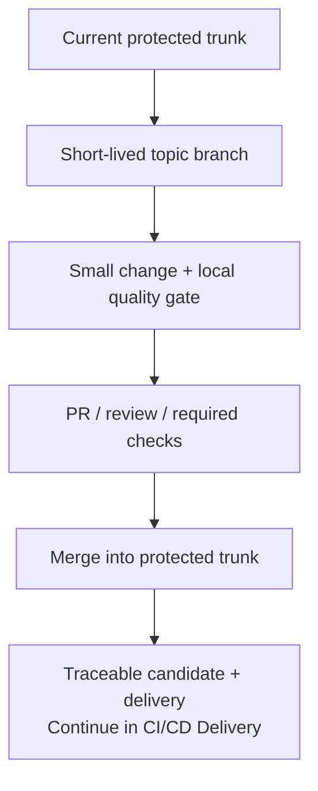

# Branching And Integration

This reference answers **how do I organise concurrent work, integrate changes, and handle releases without creating competing development lines?** It composes existing doctrine; it creates no new requirements.

If this reference conflicts with a canonical principle or owning pattern, the canonical owner wins and this reference is defective.

## Use When

Use this when choosing where to start a change, where to merge it, or how to patch a release while active development continues. For the full branch-to-production path, continue to [CI/CD Delivery](cicd-delivery.md).

## Standard Shape

Trunk is the integration point for active development. A branch holds work in progress; a release candidate identifies what can be deployed. The current tip of `main` can be ahead of production.

## Invariants

These summarise the canonical owners below, including their applicability and exception paths.

1. **One active integration line:** trunk is the default; parallel release lines need the documented product-model justification.
2. **Small, frequent integration:** topic branches last days, not weeks. Split work that cannot become a reviewable increment.
3. **Protected merge:** routine changes land through review and required checks. Documented bot-only and emergency paths retain their existing controls.
4. **Credible feedback:** the local quality gate agrees with CI; local hooks provide feedback but do not replace enforced merge checks.
5. **Deployable increments:** incomplete behaviour stays safe through compatible slices and applicable feature-flag controls.
6. **Identified authority:** source, release metadata, configuration, and deployment evidence each have a declared authority; a branch name alone does not identify a running deployment.
7. **Traceable delivery:** candidate identity and evidence survive promotion. Where unchanged promotion is possible, promote the same artefact; a rebuild creates a new candidate.
8. **No lost fixes:** hotfixes return to `main`; exceptional long-term support retains its documented EOL and exception authority.

## Normal Implementation

| Step | What the engineer does |
| --- | --- |
| Start | Take current trunk as the base for a short-lived topic branch containing one coherent change. |
| Develop | Keep the increment compatible with the running system. Run the documented local gate, including applicable lint, tests, and contract checks. |
| Review | Open a PR against trunk explaining what changed, why, and how to verify it. Include migration, security, and rollout implications where relevant. |
| Integrate | Resolve review and required checks before merging. Where a merge queue is used, it tests the prospective merge result against current trunk. |
| Deliver | Hand the accepted revision to the named build and delivery surfaces. Follow candidate-bound verification and promotion, not a chain of application-source merges between environments. |

A green topic branch is not automatically a green merge result. Use the repository's protected merge policy and chosen merge method; this reference does not mandate squash, rebase, or merge commits. See [Testing And Verification](testing-and-verification.md) for placing checks and the limits of local hooks.

### Keep These Concepts Separate

| Concept | What it identifies |
| --- | --- |
| Workspace | A local working directory, possibly containing uncommitted work. |
| Topic branch | A movable source reference for a change awaiting integration. |
| Trunk | The accepted integration state for active development. |
| Source revision | An exact committed source state, independent of later branch movement. |
| Release candidate | An identified output built from a revision and known inputs, with its own evidence. |
| Environment state | Declared candidate and configuration bindings, plus evidence of what is actually running. |

One revision can produce several deployable units; each has its own delivery surface. Merging authorises integration. Releasing, promoting to an environment, and exposing behaviour are distinct decisions. A version tag or branch label is not evidence that deployment succeeded.

## Common Variations

### Concurrent Local Work

Keep unrelated changes in separate workspaces when that helps preserve unfinished work. Worktrees and separate clones are optional techniques; neither changes the integration policy. See [Collaboration Tooling](../tooling/collaboration.md#concurrent-local-work) for worktrees and optional purpose-based branch names.

### Incomplete Features

Integrate small compatible slices instead of holding an entire feature off trunk. Where flags apply, use safe defaults, an owner, and a removal date. Enabling a flag is a rollout decision, not a merge strategy. A flag does not make destructive schema or infrastructure changes reversible; follow the relevant migration and recovery doctrine.

### Urgent Patch While Trunk Has Advanced

Follow the existing [hotfix path](../patterns/trunk-workflow.md#relation-to-release-metadata): branch from the affected tagged release, fix, tag the patch, and merge the fix back to `main`. Apply the controlled review/check path, or its recorded emergency exception, to the change. Build and verify the patch candidate before promotion; it is not the old release with inherited evidence. Carry the fix back so the next trunk release does not reintroduce the fault.

### Supported Older Releases

Long-lived support is exceptional. The [owning pattern](../patterns/trunk-workflow.md#long-term-support-lts-branches-exceptional) covers regulatory, contractual, or embedded-customer needs for years of patch-only support on a frozen major line: a named support branch, documented EOL, and security/legal ownership of the exception. Trunk remains the active-development default. Separate supported versions have distinct scopes; that does not make them competing authorities for one version.

## Boundaries

- **Desired-state layout:** GitOps overlays, directories, or branches can describe different environments. Their precedence and promotion story remain explicit. This differs from maintaining divergent application-development lines; declared state still needs reconciliation or verification against actual state.
- **Infrastructure delivery:** environment-specific plans are legitimate. Trace source, inputs, authorisation, apply, and verification; do not treat one plan as a binary to promote everywhere.
- **Release cadence:** continuous integration does not require every merge to reach production immediately. A release train can coexist with trunk. Branch strategy alone does not guarantee same-artefact promotion.
- **Naming and local tools:** prefixes and workspace mechanisms aid navigation. They create no authority and are not compliance conditions.
- **Adoption:** start with a working quality gate and a small pilot using the [Adoption Playbook](../patterns/adoption-playbook.md). Simply renaming or deleting long-lived branches does not establish a safe integration path.

## Canonical Doctrine

Layer contract: [Implementation References](README.md).

| Concern | Canonical principle or owning pattern |
| --- | --- |
| Trunk default, small changes, protected review, flags, and release cadence | [Collaboration](../principles/collaboration.md) |
| Local/CI agreement, deployable units, candidate promotion, and evidence | [Build Principles](../principles/build.md) |
| One authority per concept and explicit derivatives | [Authoritative Sources And Intentional Duplication](../principles/single-source-of-truth.md) |
| Enforced gates, pipeline trust, and exceptions | [Merge Path Evidence And Pipeline Integrity](../principles/merge-path-evidence-and-pipeline-integrity.md) |
| Fast local feedback and discoverable entrypoints | [Developer Experience](../principles/developer-experience.md) |
| Integration mechanics, hotfix propagation, and support exceptions | [Trunk Workflow And Delivery Surfaces](../patterns/trunk-workflow.md) |
| Review duties and high-risk changes | [Code Review And Change Approval](../patterns/code-review-and-change-approval.md) |
| Safe flag use and retirement | [Feature Flag Governance](../patterns/feature-flag-governance.md) |
| Stateful compatibility and recovery | [Data And Migrations](../principles/data-and-migrations.md) |
| Desired-state authority, environment layout, and drift | [GitOps And Declarative Operations](../patterns/gitops-and-declarative-operations.md) |
| Incremental adoption | [Adoption Playbook](../patterns/adoption-playbook.md) |

Tooling and verification: [Collaboration Tooling](../tooling/collaboration.md), [Collaboration Readiness](../checklists/collaboration-readiness.md), and [Release Readiness](../checklists/release-readiness.md).

Related references: [CI/CD Delivery](cicd-delivery.md) and [Testing And Verification](testing-and-verification.md).

Decisions and evidence: [ADR 0002](../../docs/adr/0002-adopt-trunk-workflow-and-cloudevents-as-portable-defaults.md), [ADR 0048](../../docs/adr/0048-add-implementation-reference-layer.md), and the [composition research note](../evolution/research-branching-integration-impl-composition-2026-09.md).
