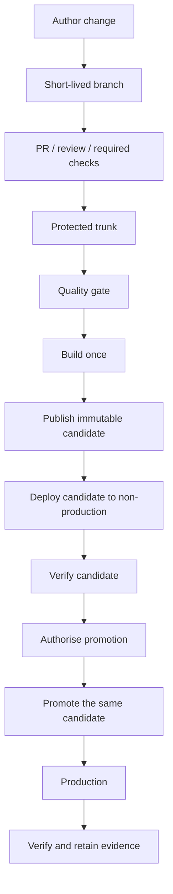
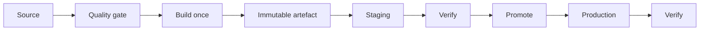
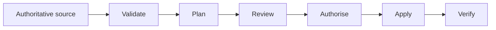
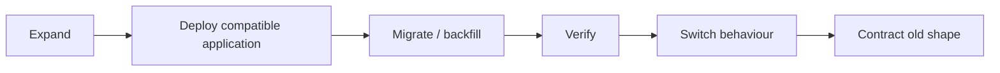
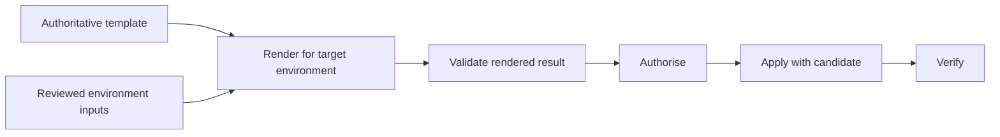

# CI/CD Delivery

This reference composes the normal delivery path in a product-neutral form; it does not replace the linked principles and patterns.

If this reference conflicts with a canonical principle or owning pattern, the canonical owner wins and this reference is defective.

## Use When

Use this reference when the question is **how does code get from a branch to production?** It is also the starting point for reviewing a delivery path before choosing CI tooling or applying the build and release checklists.

## Standard Shape

> Git establishes authorised intent. CI proves the candidate. The build creates one traceable release candidate. Environments establish confidence in that candidate rather than silently creating new ones.

Where a deployable can be promoted unchanged, build once and promote the same artefact. A rebuild is a new candidate.

## Invariants

These are concise summaries of the canonical owners linked at the end, not new requirements.

1. **Controlled source:** routine changes reach one protected integration branch through review and required checks.
2. **Discriminating gate:** a required quality or policy check fails the controlled path when its condition fails; warning-only output is telemetry, not a gate.
3. **Explicit surfaces:** quality, build, publish, deploy, and verification are named, with separate surfaces for materially different deployable units.
4. **Traceable candidate:** the evidence chain connects source revision, workflow identity, inputs, quality evidence, and the resulting candidate identity.
5. **Same candidate where possible:** binaries, images, packages, or archives proven in non-production progress unchanged to production. Rebuilding creates a different candidate that needs its own evidence.
6. **Candidate-bound authority:** approval or automated policy authorises a specific candidate and target, not an unspecified future output.
7. **Current promotion evidence:** promotion evaluates current dependency and advisory state against the exact candidate inventory; a newly relevant disclosure needs a scoped exception or exploitability record rather than inherited confidence.
8. **Evidence accumulates:** environments add deployment and runtime confidence; they do not silently replace the authoritative source or candidate.
9. **Verification closes delivery:** deployment is incomplete until the target state and health are checked and the result remains retrievable.

## Normal Implementation

| Step | Normal outcome | Evidence to retain |
| --- | --- | --- |
| Author and review | A small, coherent change is reviewed; applicable checks run against the merge path. | Source revision, review, required-check results, exception record if any. |
| Integrate | The accepted change becomes part of protected trunk. | Merge identity and protected-branch result. |
| Quality gate | The authoritative source state passes the checks that qualify it to build or publish. | Test, contract, scan, and policy results for the exact revision. |
| Build and publish | One identified release candidate is produced and stored. | Version or digest, build inputs, provenance/SBOM where applicable, publication receipt. |
| Non-production deploy | The candidate follows the intended deployment path into a representative environment. | Candidate, environment, deployment identity, configuration binding. |
| Verify | Applicable smoke, readiness, integration, security, or policy checks establish confidence. | Verification results bound to the candidate and environment. |
| Authorise and promote | Risk-appropriate human or automated authority permits the same candidate to progress. | Candidate-bound decision, actor/policy identity, scoped exception if any. |
| Production verify | The authorised candidate is enacted and checked in production. | Deployment result, runtime verification, telemetry link, recovery action if required. |

The exact gate contents depend on the repository and activated policy. Common classes include formatting, linting, tests, contract validation, secret and dependency scanning, infrastructure validation, licence policy, and release validation. Include a check only when its owning doctrine and applicability make it relevant.

## Common Variations

### Application Artefacts

This is the direct case for same-artefact promotion. Environment bindings such as configuration and identity may differ, but the application candidate does not.

### Infrastructure As Code

Plans may legitimately be environment-specific and can become stale when target state changes. The invariant is traceable source and inputs, an explicit reviewed plan or equivalent change representation, target-bound authority, controlled enactment, and verification—not pretending that a plan is a universally promotable binary.

### Database Changes

A database migration changes state and must respect compatibility, batching, recovery, and reconciliation. Migration scripts can be versioned artefacts, but the database itself is not promoted like an application binary.

### Environment-Rendered Configuration

Rendering may vary by environment. Keep the template authority, input versions, renderer identity, rendered result, target, and deployment evidence traceable. Secrets remain outside build artefacts and follow the configuration-and-secrets doctrine.

## Boundaries

- Not every repository needs every stage. Omitted surfaces are explicit and justified rather than accidental.
- Long-lived support branches can exist for documented product, contract, or regulatory constraints; they do not replace protected trunk as the normal active-development path.
- Promotion may be automated, human-authorised, or mixed according to blast radius, reversibility, external obligation, and estate policy.
- Progressive exposure, feature flags, rollback, and forward recovery operate around the candidate flow; they do not erase candidate identity or evidence.
- A platform that cannot promote an unchanged deployable records that limitation. Every rebuild remains a new candidate and receives evidence appropriate to that fact.

## Canonical Doctrine

Layer contract: [Implementation References](README.md).

| Concern | Canonical principle or owning pattern |
| --- | --- |
| Build surfaces, ordering, same-artefact promotion, and post-deploy verification | [Build Principles](../principles/build.md) |
| Protected trunk, review, required checks, immutable build identifiers, and environment progression | [Collaboration, Trunk-Based Delivery, And Operational Rigour](../principles/collaboration.md) |
| One authority per version, schema, policy, and configuration concept | [Authoritative Sources And Intentional Duplication](../principles/single-source-of-truth.md) |
| Binding gates, pipeline trust, promotion-time evidence, and exceptions | [Merge Path Evidence And Pipeline Integrity](../principles/merge-path-evidence-and-pipeline-integrity.md) |
| Delivery-surface decomposition | [Build Surface Model](../patterns/build-surface-model.md) |
| Branch-to-production workflow | [Trunk Workflow And Delivery Surfaces](../patterns/trunk-workflow.md) |
| Risk-based review and approval | [Code Review And Change Approval](../patterns/code-review-and-change-approval.md) |
| Infrastructure reconciliation and drift | [GitOps And Declarative Operations](../patterns/gitops-and-declarative-operations.md) |
| Stateful schema and data change | [Data, Migrations, Backups, And Recovery](../principles/data-and-migrations.md) |
| Applicability and bounded exceptions | [Normative Language, Applicability, And Exceptions](../patterns/normative-language-applicability-and-exceptions.md) |

Product mappings and verification prompts: [CI Platform Mapping](../tooling/ci-platform-mapping.md), [Build Readiness Checklist](../checklists/build-readiness.md), and [Release Readiness Checklist](../checklists/release-readiness.md).
