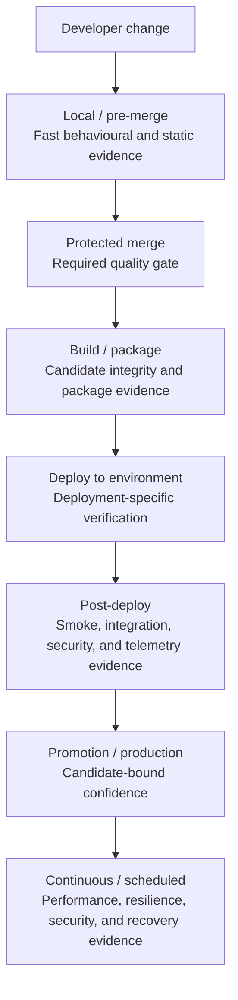
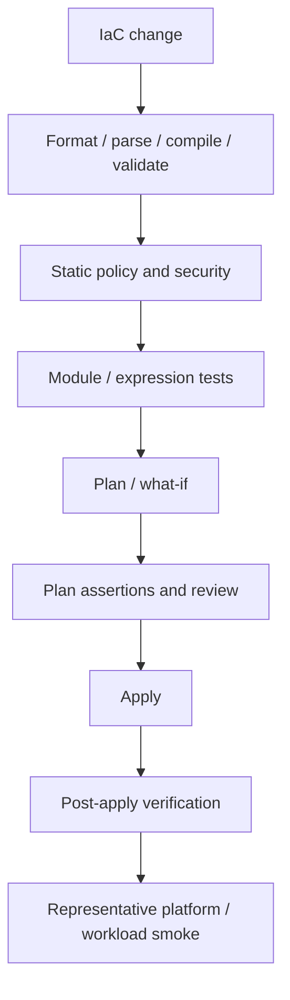
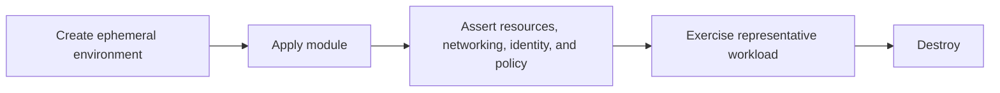
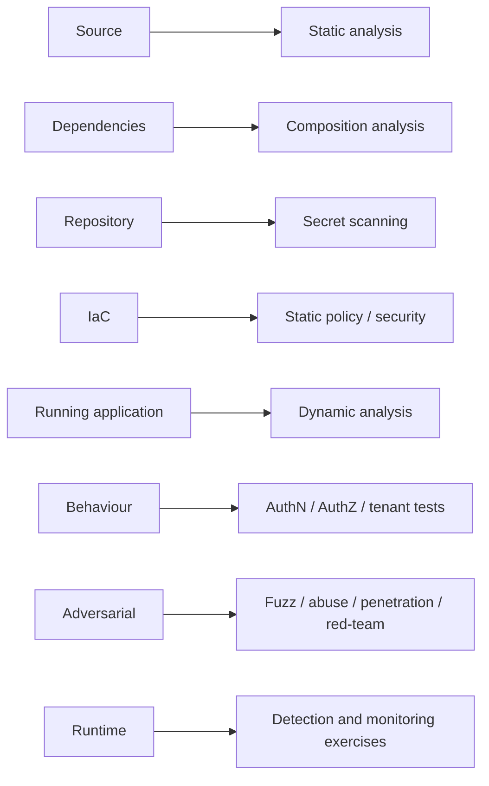

# Testing And Verification

This reference composes the normal placement of testing and verification across application and infrastructure delivery. It does not replace the linked principles and patterns.

If this reference conflicts with a canonical principle or owning pattern, the canonical owner wins and this reference is defective.

## Use When

Use this reference when deciding **what kinds of evidence belong in CI, build and packaging, application deployment, infrastructure delivery, or scheduled assurance**.

Testing terms overlap because they describe different dimensions:

| Dimension | Examples |
| --- | --- |
| Scope | Unit, component, integration, system, end-to-end |
| Purpose | Functional, regression, security, performance, resilience, migration, compatibility, recovery, operability |
| Technique | Snapshot, characterisation, property-based, fuzz, mutation, fault injection, chaos, synthetic, canary |
| Timing | Local, pre-merge, build/package, deployment, post-deploy, promotion, production, scheduled |

A smoke test can also be an integration test. A security regression can be end-to-end. A synthetic can be a functional integration test. Do not force every term into one flat taxonomy. Ask instead:

> **What claim are we trying to prove, and at which delivery surface can we prove it most cheaply and reliably?**

## Standard Shape

> **Testing is evidence placement. Put each check at the earliest delivery surface capable of proving the property credibly, then use deployed and scheduled verification for properties that only exist in real environments.**

Prove things as early as possible, but not earlier than they can actually be proven. A unit test can prove business logic, not production DNS. A plan can represent an intended infrastructure change, not prove endpoint reachability. Static telemetry configuration can be valid while no signal reaches the backend.

## Invariants

These are concise compositions of the canonical owners listed at the end, not new requirements.

1. **Name the claim:** tests and checks target a behaviour, invariant, risk, compatibility promise, or operational property.
2. **Use the earliest credible surface:** reject defects cheaply when possible; defer only claims that require a package, environment, real dependency, or runtime state.
3. **Match depth to risk:** critical boundaries and high-blast-radius paths receive stronger evidence than low-impact changes; no technique is universal.
4. **Keep surfaces distinct:** source tests, package verification, deployment verification, and scheduled assurance answer different questions.
5. **Bind evidence to identity:** build and deployment results identify the source revision, candidate, environment, inputs, and applicable policy.
6. **Test denial as well as success:** authority, isolation, policy, retry, and failure claims need negative paths capable of detecting unintended access or behaviour.
7. **Verify stateful outcomes:** a successful command or control-plane response does not by itself prove correct data, effective policy, connectivity, recovery, or workload behaviour.
8. **Preserve signal quality:** flaky, silently skipped, warning-only, or undiscriminating checks do not provide reliable gate evidence.
9. **Promote the tested candidate:** where an artefact can move unchanged, rebuilding for production creates a new candidate and invalidates inherited candidate evidence.

## Normal Implementation

### Application Evidence Before Merge

Pre-merge evidence asks whether the source change is fit to become authoritative. Natural choices include linting and formatting checks, static analysis, unit and component tests, selective integration tests, API/event/schema contracts, regressions, and boundary and negative cases. Lint code, configuration, documentation, and repository-owned infrastructure definitions where applicable. Snapshot or golden tests protect intentional structured output; characterisation tests capture legacy behaviour before change. Property-based tests, fuzzing, and mutation testing deepen evidence where generated inputs or assertion quality matter.

Security and delivery checks can include static security analysis, dependency analysis, secret scanning, and static configuration or IaC validation when the repository owns those surfaces. Apply them according to system risk and activated policy rather than as an indiscriminate menu.

Authentication, authorisation, tenant isolation, money movement, cryptography, parsers, migration logic, retry/idempotency, privileged automation, and data integrity are common reasons to add deeper negative, adversarial, concurrency, or integration evidence.

Pre-merge checks cannot prove that a deployed service is reachable, workload identity is bound correctly, a private endpoint works, telemetry arrives, failover succeeds, or a backup restores usable state.

#### Fast Local Feedback And Git Hooks

A practical default is one documented repository command for the local quality gate, backed by the same versioned scripts or task runner that CI invokes. Teams may wire a fast, deterministic subset—such as formatting, linting, generated-file checks, focused tests, or secret scanning—into version-controlled Git hook tooling so contributors receive feedback before commit or push.

Git hooks shorten the feedback loop; they are not the merge authority. Local hooks can be absent, stale, misconfigured, or deliberately bypassed, so protected-branch required checks still establish the authoritative gate. Keep hook entrypoints thin, make installation and updates obvious, and avoid putting unique validation logic in a developer's untracked hook. The durable owners are [Build Principles](../principles/build.md), [Developer Experience](../principles/developer-experience.md), [Collaboration](../principles/collaboration.md), and the [Build Surface Model](../patterns/build-surface-model.md).

### Build And Package Verification

This surface asks:

> **Did we produce the thing we intended to deploy?**

Applicable evidence can include compilation, package contents, version and manifest validation, locked dependency resolution, SBOM and provenance generation, signatures or checksums, container inspection, installation, minimal startup, and runtime/OS compatibility that the product actually claims.

The evidence remains bound to the candidate identity. A well-formed package can still fail after deployment because environment configuration, networking, identity, certificates, DNS, or dependencies are wrong.

### Application Deployment Verification

This surface asks:

> **Did this exact candidate deploy correctly into this environment?**

- **Health/readiness** is narrow workload or platform health: process state, readiness, dependency availability, or routing registration. Green health is not proof of a critical business path.
- **Smoke** is a small set of critical probes answering whether the deployment is fundamentally alive: a response, authentication, a safe read/write, message consumption, or database connectivity.
- **Environment integration** proves real wiring to databases, queues, identity providers, secret stores, object stores, and downstream services.
- **Runtime security** exercises applicable authentication, authorisation, tenant isolation, TLS/security headers, known abuse regressions, and dynamic analysis.
- **Observability verification** proves logs and metrics arrive, traces propagate, deployed version is visible, audit events emit, and an expected signal reaches alerting.

A **synthetic** is a fake transaction against a deployed system; it may run immediately after deployment or continuously. A **canary** is a deployment strategy plus comparison and verification. It can bound exposure while evaluating errors, latency, resource behaviour, business correctness, and security signals, but it does not replace other testing.

## Infrastructure Delivery

Infrastructure delivery uses a different evidence chain from application binaries. Terraform, Bicep, and equivalent declarative IaC are examples; product-specific commands and policy engines belong in tooling guidance.

### Before Apply

- **Format, parse, compile, and validate** establish structural correctness. They cannot prove intended behaviour.
- **Static policy and security** can reject unintended public access, missing encryption or metadata, incorrect identity models, forbidden resource shapes, and invalid network policy.
- **Module/expression tests** are useful for reusable modules, conditionals, defaults, naming, identity assignment, network rules, policy composition, and outputs.
- **Plan/what-if** represents intended change. Review creates, changes, destroys, replacements, privilege/network changes, data-destructive operations, and unexpected churn.
- **Plan assertions** mechanically protect critical invariants where practical: do not destroy a database or create a public endpoint; retain diagnostics, expected private connectivity, and the intended identity class.

> A plan is evidence of intended change, not proof of successful deployment.

### After Apply

> **An infrastructure apply or control-plane deployment succeeding proves that the control plane accepted the operations. It does not prove the infrastructure works.**

Post-apply verification selects the claims that matter:

- **Resource state:** expected resources and configuration exist in the intended state.
- **Connectivity:** DNS, routing, private endpoints, public exposure, and protocol reachability behave from the relevant network location.
- **Identity and authority:** expected identities succeed and unexpected identities or forbidden operations are denied.
- **Effective policy:** the resulting state—not only the declaration—enforces access, encryption, diagnostics, and network restrictions.
- **Platform smoke:** a representative container schedules, function executes, workload identity resolves, runtime DNS works, or a workload reaches its intended dependency.

> A platform that can create resources but cannot successfully run a representative workload is not proven.

### Ephemeral Infrastructure Integration

This is useful for high-value network, identity, private-connectivity, runtime/platform, and shared policy modules. It is slower and incurs real infrastructure cost, so select it by risk and reuse rather than running every deep scenario on every change.

## Stateful And Deep Verification

### Migrations

Applicable evidence includes migration validation against representative data, backward compatibility, forward compatibility where claimed, count/checksum reconciliation, constraint checks, realistic-volume performance, idempotency and retry behaviour, and rollback or forward-recovery rehearsal. A migration command exiting zero is not proof that data is correct.

### Performance

| Type | Question |
| --- | --- |
| Benchmark | Did a repeatable operation regress? |
| Load | Can the system handle a realistic expected workload? |
| Stress | Where and how does the system fail? |
| Spike | What happens under sudden demand? |
| Soak | Does the system degrade over time? |
| Scalability | Does added capacity have the expected effect? |
| Volume | Can the system handle very large data or state? |

Performance evidence can be a targeted pre-merge benchmark, scheduled suite, pre-release run, canary comparison, or production telemetry. A long soak test is rarely a useful gate for every small PR.

### Resilience And Recovery

Fault injection can exercise timeouts, bounded retries, dependency loss, backlog, partial failure, and degraded networks. Chaos is a controlled experiment with a hypothesis, scope/blast radius, abort condition, observation, owner, and recovery path—not random failure injection. Failover and disaster-recovery exercises test the actual transition and operator path.

> A successful backup job is not proof of recovery. Restore it.

### Security Across Surfaces

Avoid the undifferentiated claim “security tested.” Each check discriminates particular failure classes. Sensitive authority boundaries need both permitted and denied paths.

### Concurrency, Retry, And Idempotency

Workers, queues, webhooks, parallel requests, distributed locks, retries, at-least-once delivery, and material state transitions deserve explicit duplicate, race, deadlock, backoff, bounded-retry, and DLQ/parking evidence where applicable. Exercise these near component and integration scope so they are not left entirely to slow E2E suites.

### Compatibility

Test the compatibility matrix the product actually claims: backward/forward API and event schemas, data, runtime, OS/browser, upgrade, and downgrade paths as applicable. An isolated successful run does not create a permanent compatibility promise; the declared support boundary does.

## Delivery Placement Matrices

These matrices identify likely evidence placement; they do not define a flat test taxonomy or a universal gate set.

- `✓` — a common natural surface for this evidence.
- `△` — selective: use when the claim, risk, or cost warrants it.
- `—` — normally proved at another surface.

### Application Delivery

| Evidence | Pre-merge | Build/package | Deployed environment | Scheduled/deep |
| --- | :---: | :---: | :---: | :---: |
| Lint / format / static analysis | ✓ | — | — | — |
| Unit / component | ✓ | — | — | — |
| Integration / contract / schema | ✓ | △ | ✓ | △ |
| Regression / boundary / negative | ✓ | — | △ | △ |
| Snapshot / characterisation | ✓ | △ | — | — |
| Property-based / fuzz / mutation | △ | — | △ | △ |
| SAST / SCA / secret scanning | ✓ | ✓ | — | △ |
| Package identity / contents / startup | — | ✓ | △ | — |
| Health / smoke / synthetic | — | △ | ✓ | ✓ |
| Authentication / authorisation / tenant isolation | △ | — | ✓ | △ |
| Dynamic security / adversarial | — | — | △ | △ |
| Critical E2E journey | △ | — | ✓ | △ |
| Benchmark / load | △ | — | △ | ✓ |
| Stress / spike / soak / volume | — | — | △ | ✓ |
| Resilience / fault / recovery | △ | — | △ | ✓ |
| Migration / data reconciliation | △ | ✓ | ✓ | △ |
| Observability verification | △ | — | ✓ | ✓ |
| Canary verification | — | — | △ | — |

The build/package column concerns the candidate: its identity, contents, dependency graph, migration assets, installation, and minimal startup. Deployed-environment checks concern real wiring and behaviour. Scheduled checks carry slower, destructive, costly, or continuously changing evidence; they do not replace earlier checks.

### Infrastructure Delivery

| Evidence | Pre-merge | Post-apply | Scheduled/deep |
| --- | :---: | :---: | :---: |
| Lint / format / parse / compile / validate | ✓ | — | — |
| Static security / policy | ✓ | — | △ |
| Module / expression tests | ✓ | — | — |
| Plan / what-if review | ✓ | — | — |
| Plan assertions | ✓ | — | — |
| Ephemeral integration | △ | — | △ |
| Resource-state assertions | — | ✓ | △ |
| DNS / routing / endpoint connectivity | — | ✓ | △ |
| Identity / authority / effective policy | △ | ✓ | △ |
| Representative workload / platform smoke | — | ✓ | △ |
| Observability / diagnostic export | △ | ✓ | ✓ |
| Drift detection | — | — | ✓ |
| Capacity / failover / backup restore / DR | — | △ | ✓ |

For infrastructure, pre-merge evidence predicts or constrains the intended change; post-apply evidence proves effective state and behaviour. A later `✓` therefore complements rather than repeats an earlier check. For example, static network policy cannot replace a connectivity probe, and a successful apply cannot replace a representative workload smoke test.

## Minimum Practical Sets

These are starting compositions, not universal checklists. Remove or add evidence according to the claims, risks, and canonical applicability rules.

### Typical Application Or Service

Start with fast unit tests, selective integration and contract checks, regressions and negative boundaries, applicable static security/dependency/secret checks, package verification, post-deploy smoke and environment integration, observability verification, and a few critical E2E journeys. Add property, fuzz, mutation, load, resilience, dynamic security, migration, idempotency/concurrency, canary, or continuous synthetic evidence when the risk warrants it.

### Typical Declarative Infrastructure Repository

Start with format/parse/compile/validate, applicable static policy and security, module tests where useful, plan/what-if review, mechanical assertions for critical invariants, apply, post-apply resource/connectivity/authority checks, and representative platform smoke. Add ephemeral integration, negative policy, drift, failover, disaster recovery, and representative workload deployment according to reuse and blast radius.

### Shared Platform

Combine infrastructure evidence with consumer behaviour: module and policy validation, apply verification, identity and networking, runtime scheduling/execution, a golden-path application deployment, telemetry, recovery, upgrade/compatibility, and capacity. Test through the interface platform consumers actually use.

## Anti-Patterns

| Claim | What it misses |
| --- | --- |
| “We have 90% coverage.” | Coverage is execution, not assertion quality or risk coverage. |
| “Everything is E2E.” | Cheaper credible evidence belongs lower; E2E stays focused on critical journeys. |
| “Infrastructure apply succeeded.” | Control-plane acceptance does not prove effective networking, authority, policy, or workload behaviour. |
| “Health is green.” | Narrow health does not prove the critical path. |
| “The scanner passed.” | One scanner covers only the failure classes it can discriminate. |
| “The backup succeeded.” | Recovery remains unproven until restoration is exercised. |
| “We test retries.” | Duplicate delivery, idempotency, concurrency, and first-outcome behaviour may still fail. |
| “Staging passed; rebuild for production.” | A rebuild is a new candidate. Promote the tested artefact where possible. |

## Boundaries

- Not every test belongs in every repository or on every change. Applicability follows the owned surface, declared support, material claim, blast radius, and external obligations.
- A required gate blocks when its condition fails; advisory scans and scheduled discovery remain visible but are not represented as gates.
- Real-environment tests cost time, infrastructure, and operational risk. Use representative depth and explicit ownership; do not hide them in a universal per-PR suite.
- Product commands, frameworks, and platform-specific mappings belong in tooling or estate guidance.

## Canonical Doctrine

Layer contract: [Implementation References](README.md). Related composition: [CI/CD Delivery](cicd-delivery.md).

| Concern | Canonical principle or owning pattern |
| --- | --- |
| Evidence-driven portfolio, contracts, flakiness, risk depth, adversarial/property/mutation testing | [Testing Strategy](../principles/testing-strategy.md) |
| Quality, build/package, deploy, verify, scheduled assurance, candidate evidence | [Build Principles](../principles/build.md) |
| Fast local feedback, contributor onboarding, and documented local entrypoints | [Developer Experience](../principles/developer-experience.md), [Build Surface Model](../patterns/build-surface-model.md) |
| Protected merge, local/CI ordering, promotion, rollout | [Collaboration, Trunk-Based Delivery, And Operational Rigour](../principles/collaboration.md) |
| Binding gates, pipeline evidence, promotion-time state | [Merge Path Evidence And Pipeline Integrity](../principles/merge-path-evidence-and-pipeline-integrity.md) |
| API authentication, authorisation, limits, and runtime security boundaries | [API Boundaries, HTTP Semantics, And API Security](../principles/api-boundaries-and-security.md) |
| Event schemas, delivery semantics, and consumer expectations | [Event And Message Contracts](../principles/event-contracts.md) |
| Migrations, reconciliation, backups, restores, and DR | [Data, Migrations, Backups, And Recovery](../principles/data-and-migrations.md) |
| Retry and failure behaviour | [Errors And Failure Modes](../principles/errors-and-failure-modes.md) |
| SLOs, failover exercises, chaos, and operational recovery | [Reliability: SLOs, Error Budgets, And Incidents](../principles/reliability-slo-incidents.md), [Chaos Engineering And Game Days](../patterns/chaos-engineering-and-game-days.md) |
| Telemetry and alerting evidence | [Observability](../principles/observability.md) |
| Performance budgets, load, and capacity | [Performance, Load, And Cost](../principles/performance-and-cost.md) |
| Static security and vulnerability response | [Secure Development Lifecycle And Vulnerability Response](../principles/secure-development-lifecycle.md) |
| Dependency graph, SBOM, and advisory evidence | [Dependencies And Supply Chain](../principles/dependencies-supply-chain.md) |
| Workload identity and least authority | [Zero Trust And Workload Identity](../principles/zero-trust-and-workload-identity.md) |
| Duplicate and concurrent effects across HTTP, messages, infrastructure, and data | [Idempotency Across Boundaries](../patterns/idempotency-across-boundaries.md) |
| Retry, DLQ/parking, replay, and backlog behaviour | [Message Channel Operations](../patterns/message-channel-operations.md) |

Tooling and review routes: [CI Platform Mapping](../tooling/ci-platform-mapping.md), [Build Readiness Checklist](../checklists/build-readiness.md), and [Release Readiness Checklist](../checklists/release-readiness.md).

Decision and composition record: [ADR 0048](../../docs/adr/0048-add-implementation-reference-layer.md) and [Testing And Verification Implementation Composition](../evolution/research-testing-verification-impl-composition-2026-09.md).
