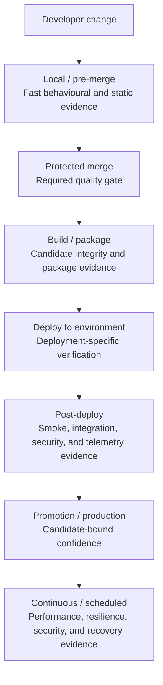
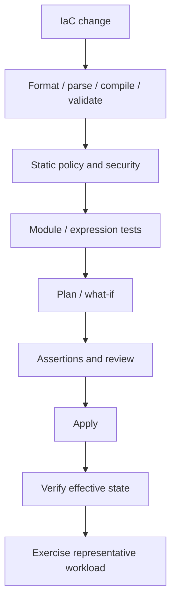

# Testing And Verification

This reference composes the normal placement of testing and verification across application and infrastructure delivery. It does not replace the linked principles and patterns.

If this reference conflicts with a canonical principle or owning pattern, the canonical owner wins and this reference is defective.

## Use When

Use this reference when deciding **what kinds of evidence belong in CI, build and packaging, application deployment, infrastructure delivery, or scheduled assurance**.

Testing terms overlap because they describe different dimensions:

| Dimension | Examples |
| --- | --- |
| Scope | Unit, component, integration, system, end-to-end |
| Purpose | Functional, regression, security, performance, resilience, migration, compatibility, recovery, operability |
| Technique | Snapshot, characterisation, property-based, fuzz, mutation, fault injection, chaos, synthetic, canary |
| Timing | Local, pre-merge, build/package, deployment, post-deploy, promotion, production, scheduled |

A smoke test can also be an integration test. A security regression can be end-to-end. A synthetic can be a functional integration test. Do not force every term into one flat taxonomy. Ask instead:

> **What claim are we trying to prove, and at which delivery surface can we prove it most cheaply and reliably?**

## Standard Shape

> **Testing is evidence placement. Put each check at the earliest delivery surface capable of proving the property credibly, then use deployed and scheduled verification for properties that only exist in real environments.**

Prove things as early as possible, but not earlier than they can actually be proven. A unit test can prove business logic, not production DNS. A plan can represent an intended infrastructure change, not prove endpoint reachability. Static telemetry configuration can be valid while no signal reaches the backend.

## Invariants

These are concise compositions of the canonical owners listed at the end, not new requirements.

1. **Name the claim:** tests and checks target a behaviour, invariant, risk, compatibility promise, or operational property.
2. **Use the earliest credible surface:** reject defects cheaply when possible; defer only claims that require a package, environment, real dependency, or runtime state.
3. **Match depth to risk:** critical boundaries and high-blast-radius paths receive stronger evidence than low-impact changes; no technique is universal.
4. **Keep surfaces distinct:** source tests, package verification, deployment verification, and scheduled assurance answer different questions.
5. **Bind evidence to identity:** build and deployment results identify the source revision, candidate, environment, inputs, and applicable policy.
6. **Test denial as well as success:** authority, isolation, policy, retry, and failure claims need negative paths capable of detecting unintended access or behaviour.
7. **Verify stateful outcomes:** a successful command or control-plane response does not by itself prove correct data, effective policy, connectivity, recovery, or workload behaviour.
8. **Preserve signal quality:** flaky, silently skipped, warning-only, or undiscriminating checks do not provide reliable gate evidence.
9. **Promote the tested candidate:** where an artefact can move unchanged, rebuilding for production creates a new candidate and invalidates inherited candidate evidence.

## Normal Implementation

### Local And Pre-Merge

This surface asks whether the source change is fit to become authoritative. It commonly holds formatting and linting, static analysis, unit/component tests, selective integration and contract checks, regressions, boundary and negative cases, and applicable security, dependency, secret, configuration, or IaC checks. Property-based, fuzz, snapshot, characterisation, and mutation techniques add depth where the risk warrants them.

A practical default is one documented local quality-gate command backed by the same versioned scripts or task runner that CI invokes. A version-controlled Git-hook setup may run its fast deterministic subset before commit or push. Hooks shorten feedback; they are not merge authority because they may be absent, stale, misconfigured, or bypassed. Protected required checks remain authoritative.

### Build And Package

This surface asks: **did we produce the thing we intended to deploy?** Evidence can cover compilation, package identity and contents, version and manifest validation, locked dependencies, SBOM/provenance, signatures or checksums, container inspection, installation, minimal startup, migration assets, and claimed runtime compatibility. Bind results to the candidate identity; package correctness does not prove environment behaviour.

### Application Deployment

This surface asks: **did this exact candidate deploy correctly into this environment?**

Health/readiness proves narrow workload or platform state. Smoke probes a few critical paths. Environment integration proves real wiring to data, messaging, identity, secrets, and downstream services. Runtime checks prove applicable authentication, authorisation, isolation, TLS, and known security regressions. Observability verification proves that signals arrive with candidate identity and usable correlation. Synthetics may repeat deployed transactions; canaries bound exposure while comparing behaviour, but neither substitutes for earlier evidence.

### Infrastructure Delivery

Infrastructure evidence follows a different lifecycle from application binaries:

Before enactment, structural checks, module tests, policy, plans, and assertions constrain the intended change. Review concentrates on create/change/destroy/replace actions, authority or network changes, destructive effects, and unexpected churn. A plan is intended-change evidence, not proof of deployment.

After enactment, verify resource state, DNS/routing/endpoints, positive and negative authority, effective policy, diagnostic export, and representative platform behaviour. A successful apply proves control-plane acceptance, not working infrastructure. High-value shared network, identity, connectivity, policy, or platform modules may justify an ephemeral environment that is created, exercised with a representative workload, and destroyed.

### Scheduled And Deep Assurance

Use deployed or scheduled verification for claims that need realistic duration, load, failure, authority, data, or changing external state:

| Claim family | Typical evidence | Natural surfaces |
| --- | --- | --- |
| Performance | Benchmark, load, stress, spike, soak, scalability, volume | Targeted CI, deployed, scheduled |
| Resilience and recovery | Fault injection, controlled chaos, failover, restore, disaster recovery | Deployed, scheduled |
| Security | Dynamic analysis, negative authority, fuzz, abuse, penetration, detection exercises | Pre-merge, deployed, scheduled |
| Stateful change | Migration validation, compatibility, reconciliation, recovery, realistic volume | Build, deployed, scheduled |
| Concurrency and delivery | Duplicate delivery, races, locks, bounded retry/backoff, idempotency, DLQ/parking | Component, integration, scheduled |
| Compatibility | Claimed API, event, data, runtime, OS/browser, upgrade/downgrade matrix | Build, integration, upgrade rehearsal |

Depth remains claim-specific. Chaos is a controlled experiment with a hypothesis, bounded scope, abort condition, observation, owner, and recovery path. A successful backup job is not restore evidence; a migration command exiting zero is not data reconciliation; one scanner is not evidence for every security failure class. Test only the compatibility matrix the product actually claims.

## Delivery Placement Matrices

These matrices identify likely evidence placement; they do not define a flat test taxonomy or a universal gate set.

- `✓` — a common natural surface for this evidence.
- `△` — selective: use when the claim, risk, or cost warrants it.
- `—` — normally proved at another surface.

### Application Delivery

| Evidence | Pre-merge | Build/package | Deployed environment | Scheduled/deep |
| --- | :---: | :---: | :---: | :---: |
| Lint / format / static analysis | ✓ | — | — | — |
| Unit / component | ✓ | — | — | — |
| Integration / contract / schema | ✓ | △ | ✓ | △ |
| Regression / boundary / negative | ✓ | — | △ | △ |
| Snapshot / characterisation | ✓ | △ | — | — |
| Property-based / fuzz / mutation | △ | — | △ | △ |
| SAST / SCA / secret scanning | ✓ | ✓ | — | △ |
| Package identity / contents / startup | — | ✓ | △ | — |
| Health / smoke / synthetic | — | △ | ✓ | ✓ |
| Authentication / authorisation / tenant isolation | △ | — | ✓ | △ |
| Dynamic security / adversarial | — | — | △ | △ |
| Critical E2E journey | △ | — | ✓ | △ |
| Benchmark / load | △ | — | △ | ✓ |
| Stress / spike / soak / volume | — | — | △ | ✓ |
| Resilience / fault / recovery | △ | — | △ | ✓ |
| Migration / data reconciliation | △ | ✓ | ✓ | △ |
| Observability verification | △ | — | ✓ | ✓ |
| Canary verification | — | — | △ | — |

The build/package column concerns the candidate: its identity, contents, dependency graph, migration assets, installation, and minimal startup. Deployed-environment checks concern real wiring and behaviour. Scheduled checks carry slower, destructive, costly, or continuously changing evidence; they do not replace earlier checks.

### Infrastructure Delivery

| Evidence | Pre-merge | Post-apply | Scheduled/deep |
| --- | :---: | :---: | :---: |
| Lint / format / parse / compile / validate | ✓ | — | — |
| Static security / policy | ✓ | — | △ |
| Module / expression tests | ✓ | — | — |
| Plan / what-if review | ✓ | — | — |
| Plan assertions | ✓ | — | — |
| Ephemeral integration | △ | — | △ |
| Resource-state assertions | — | ✓ | △ |
| DNS / routing / endpoint connectivity | — | ✓ | △ |
| Identity / authority / effective policy | △ | ✓ | △ |
| Representative workload / platform smoke | — | ✓ | △ |
| Observability / diagnostic export | △ | ✓ | ✓ |
| Drift detection | — | — | ✓ |
| Capacity / failover / backup restore / DR | — | △ | ✓ |

For infrastructure, pre-merge evidence predicts or constrains the intended change; post-apply evidence proves effective state and behaviour. A later `✓` therefore complements rather than repeats an earlier check. For example, static network policy cannot replace a connectivity probe, and a successful apply cannot replace a representative workload smoke test.

## Common Starting Compositions

These are orientation, not compliance checklists:

| Work type | Minimum useful evidence shape |
| --- | --- |
| Application or service | Fast source evidence, candidate/package verification, deployed smoke and integration, critical user journeys |
| Declarative infrastructure | Static and plan evidence, post-apply state/authority/connectivity, representative workload |
| Shared platform | Infrastructure evidence plus verification through the interface and golden path consumers actually use |

Add deeper evidence according to claims, blast radius, reuse, compatibility promises, and activated canonical policy. Use the linked readiness checklists for review rather than expanding this table into another control surface.

## Anti-Patterns

| Claim | What it misses |
| --- | --- |
| “We have 90% coverage.” | Coverage is execution, not assertion quality or risk coverage. |
| “Everything is E2E.” | Cheaper credible evidence belongs lower; E2E stays focused on critical journeys. |
| “Infrastructure apply succeeded.” | Control-plane acceptance does not prove effective networking, authority, policy, or workload behaviour. |
| “Health is green.” | Narrow health does not prove the critical path. |
| “The scanner passed.” | One scanner covers only the failure classes it can discriminate. |
| “The backup succeeded.” | Recovery remains unproven until restoration is exercised. |
| “We test retries.” | Duplicate delivery, idempotency, concurrency, and first-outcome behaviour may still fail. |
| “Staging passed; rebuild for production.” | A rebuild is a new candidate. Promote the tested artefact where possible. |

## Boundaries

- Not every test belongs in every repository or on every change. Applicability follows the owned surface, declared support, material claim, blast radius, and external obligations.
- A required gate blocks when its condition fails; advisory scans and scheduled discovery remain visible but are not represented as gates.
- Real-environment tests cost time, infrastructure, and operational risk. Use representative depth and explicit ownership; do not hide them in a universal per-PR suite.
- Product commands, frameworks, and platform-specific mappings belong in tooling or estate guidance.

## Canonical Doctrine

Layer contract: [Implementation References](README.md). Related composition: [CI/CD Delivery](cicd-delivery.md).

| Concern | Canonical principle or owning pattern |
| --- | --- |
| Evidence-driven portfolio, contracts, flakiness, risk depth, adversarial/property/mutation testing | [Testing Strategy](../principles/testing-strategy.md) |
| Quality, build/package, deploy, verify, scheduled assurance, candidate evidence | [Build Principles](../principles/build.md) |
| Fast local feedback, contributor onboarding, and documented local entrypoints | [Developer Experience](../principles/developer-experience.md), [Build Surface Model](../patterns/build-surface-model.md) |
| Protected merge, local/CI ordering, promotion, rollout | [Collaboration, Trunk-Based Delivery, And Operational Rigour](../principles/collaboration.md) |
| Binding gates, pipeline evidence, promotion-time state | [Merge Path Evidence And Pipeline Integrity](../principles/merge-path-evidence-and-pipeline-integrity.md) |
| API authentication, authorisation, limits, and runtime security boundaries | [API Boundaries, HTTP Semantics, And API Security](../principles/api-boundaries-and-security.md) |
| Event schemas, delivery semantics, and consumer expectations | [Event And Message Contracts](../principles/event-contracts.md) |
| Migrations, reconciliation, backups, restores, and DR | [Data, Migrations, Backups, And Recovery](../principles/data-and-migrations.md) |
| Retry and failure behaviour | [Errors And Failure Modes](../principles/errors-and-failure-modes.md) |
| SLOs, failover exercises, chaos, and operational recovery | [Reliability: SLOs, Error Budgets, And Incidents](../principles/reliability-slo-incidents.md), [Chaos Engineering And Game Days](../patterns/chaos-engineering-and-game-days.md) |
| Telemetry and alerting evidence | [Observability](../principles/observability.md) |
| Performance budgets, load, and capacity | [Performance, Load, And Cost](../principles/performance-and-cost.md) |
| Static security and vulnerability response | [Secure Development Lifecycle And Vulnerability Response](../principles/secure-development-lifecycle.md) |
| Dependency graph, SBOM, and advisory evidence | [Dependencies And Supply Chain](../principles/dependencies-supply-chain.md) |
| Workload identity and least authority | [Zero Trust And Workload Identity](../principles/zero-trust-and-workload-identity.md) |
| Duplicate and concurrent effects across HTTP, messages, infrastructure, and data | [Idempotency Across Boundaries](../patterns/idempotency-across-boundaries.md) |
| Retry, DLQ/parking, replay, and backlog behaviour | [Message Channel Operations](../patterns/message-channel-operations.md) |

Tooling and review routes: [CI Platform Mapping](../tooling/ci-platform-mapping.md), [Build Readiness Checklist](../checklists/build-readiness.md), and [Release Readiness Checklist](../checklists/release-readiness.md).

Decision and composition record: [ADR 0048](../../docs/adr/0048-add-implementation-reference-layer.md) and [Testing And Verification Implementation Composition](../evolution/research-testing-verification-impl-composition-2026-09.md).
