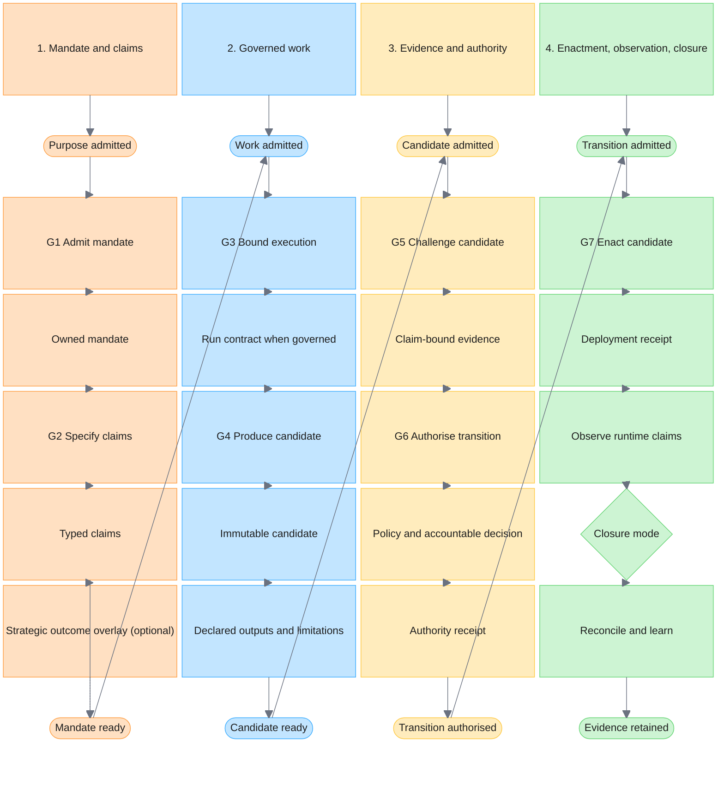

# AI-Native Software Development Lifecycle

Use this pattern when AI agents or model-mediated automation participate in software delivery. AI changes the speed and provenance of candidate production; it does not collapse the distinctions that make change governable:

> Intent is not implementation. Implementation is not evidence. Evidence is not authority. Authority is not enactment. Enactment is not outcome.

The lifecycle therefore governs **evidence-backed transitions** between separately addressable records. It keeps the familiar work of discovery, design, implementation, release, and operation, while making candidate identity, challenge, authority, enactment, and observation explicit.

This pattern implements [ADR 0030](../../docs/adr/0030-refine-ai-native-sdlc-into-gates-records-and-applicability-overlays.md), which amends [ADR 0024](../../docs/adr/0024-adopt-a-doctrine-grounded-ai-native-software-development-lifecycle.md). Its claim-by-claim research basis and source limits are recorded in [research-ai-native-sdlc-2026-07.md](../evolution/research-ai-native-sdlc-2026-07.md).

---

## 1. Scope And Non-Goals

Apply this pattern when AI drafts or changes executable intent, invokes delivery tools, evaluates a candidate, recommends approval, coordinates delegated work, or operates on a change whose result may enter a controlled delivery path.

This pattern is not:

- permission for an agent to merge, deploy, or change production directly;
- a replacement for secure development, protected branches, CI, supply-chain controls, or accountable review;
- a requirement to encode a new workflow product, central database, or eleven status fields;
- a rule that every incidental use of autocomplete, explanation, or fully inspected drafting is a governed execution;
- a rule that every change needs a KPI, causal product hypothesis, or portfolio review; or
- a linear waterfall. Work may loop, stop, or return to the earliest falsified assumption.

Issues, repositories, CI runs, artefact stores, deployment records, policy systems, and telemetry may together hold the lifecycle record. Reuse controlled systems of record before adding orchestration.

## 2. Five-Minute Field Guide

This is a training view over the canonical rules below, not a second authority surface.

| Principle | Remember |
| --- | --- |
| **Start with an accountable mandate.** Know the customer, mission, business, risk, operational, or obligation purpose and its owner. Strategic work uses outcomes rather than task completion as success. | Outputs are not outcomes. |
| **Keep every change traceable.** Link purpose, claims, candidate, decision, enactment, and observed result. Use an objective/intervention link only where it genuinely applies. | If its purpose cannot be defended, do not create the work merely because generation is cheap. |
| **AI may propose; policy and accountable people authorise.** AI may analyse, design, implement, review, and recommend. It does not become production authority. | Assistance is not authority. |
| **Challenge material claims.** First-party tests are evidence, but no producer is the only challenge where the verifier can fail for the same reason. | Every material claim needs a discriminating challenge surface. |
| **Trust evidence, not confidence.** Assertions, model scores, and majority votes are not proof. Tests, review, policy decisions, receipts, and runtime behaviour support bounded claims. | Evidence beats confidence. |
| **Build once and promote the artefact.** Test and approve the immutable candidate that later environments receive. | Same artefact, all environments. |
| **Let impact determine controls.** Capability and materiality are separate; the stricter applicable control wins. | Risk drives controls. |
| **Bound governed agent work.** Define scope, inputs, permissions, tools, outputs, limits, stops, and evidence before execution. | Every governed execution has a contract. |
| **Deployment starts observation.** Enactment proves neither acceptable runtime behaviour nor stakeholder value. Be ready to contain or roll back. | Production supplies evidence. |
| **Learn from actual behaviour.** Compare claims and expected effects with observation, then revise designs, controls, or interventions. | Reality can falsify the plan. |

## 3. Invariants

1. **Authoritative records are identified and versioned.** Repository state is authoritative for repository-owned executable intent. External configuration, deployment, model, policy, or workflow state uses its own controlled record and remains linked and reconcilable.
2. **Mandate, claims, evidence, decisions, and receipts remain addressable.** They identify the candidate, target, scope, and time they cover.
3. **Every governed execution has a run contract.** Activation and the v1 boundary are defined in [run-contracts.md](run-contracts.md).
4. **Agents may propose; policy authorises.** A model output, self-score, multi-model vote, or agent-authored approval is not merge or deployment authority.
5. **Challenge uses diverse failure modes.** Producer-run tests are valid first-party evidence. Required independence scales with claim type and materiality and asks whether the challenge can fail for the same reason as the producer.
6. **Final control execution is bounded and reconstructable.** Identity, policy version, inputs, target, decision, and result are explicit. Open-ended model discretion stays outside the final authority boundary.
7. **Promote the same artefact.** Authorisation addresses an immutable digest or equivalent identity; later environments do not rebuild a semantically different candidate.
8. **Risk controls scale on two axes.** AI capability tier and change materiality are recorded separately; controls use the stricter applicable result.
9. **High-impact change is human-gated.** Authentication, authorisation, cryptography, tenant isolation, data/schema migration, pipeline/policy, irreversible operations, person-affecting decisions, and estate-defined high-impact classes require accountable human approval.
10. **Uncertainty cannot silently become success.** Missing, stale, untrusted, or inconclusive evidence blocks where the evidence is required. A waiver is a separate, expiring authority decision and never changes the technical result.
11. **Enactment is not completion.** Runtime observation selects technical, operational, or outcome closure and reopens or contains work when claims diverge from reality.
12. **Auditability is not surveillance.** Retain change-relevant identities, actions, receipts, decisions, evidence, and outcomes; do not require private chain-of-thought or unnecessary prompt, personal, or secret data.
13. **Delegation cannot widen authority.** Multi-agent work uses owned workspaces or an explicit merge protocol, immutable inputs, bounded delegation, typed handoffs, cancellation propagation, resume revalidation, and reconciliation of shared state; see [agentic-loop-design.md](agentic-loop-design.md) §8.

## 4. Mandates And Optional Outcome Linkage

Every change has an accountable mandate. Choose the justification class that matches why the work exists:

| Justification class | Minimum mandate | Additional overlay |
| --- | --- | --- |
| **Product or strategic intervention** | Stakeholder need, objective, owner, scope, materiality, non-goals. | Apply [Outcome And Portfolio Linkage](outcome-and-portfolio-linkage.md): measures/guardrails, intervention hypothesis, attribution limits, and continue/change/stop review. |
| **External or standing obligation** | Governing authority, obligation, affected boundary, owner, due condition. | Add a revision-pinned control profile where applicable. |
| **Vulnerability or incident response** | Exposure/incident, affected system, urgency, containment objective, owner. | Use emergency authority and evidence rules without inventing a product KPI. |
| **Compatibility or lifecycle maintenance** | Dependency/platform condition, supported-state target, affected consumers, owner. | Add migration and deprecation evidence where relevant. |
| **Invariant preservation or risk reduction** | Invariant/exposure, expected risk reduction, affected boundary, owner. | Add threat, reliability, or operational evidence appropriate to the claim. |
| **Enabling work** | Authorised capability enabled, dependency, bounded output, owner. | Link to the accepted capability or programme; output completion still does not prove later value. |

An agent may propose mandate wording or decomposition. It cannot self-assign organisational priority, funding, external authority, or risk acceptance.

## 5. Seven Operational Gates

The gates are decision boundaries, not mandatory team names or workflow statuses. A low-materiality change may cross several in one pull request, but it does not skip their obligations.

| Gate | Question | Minimum exit evidence |
| --- | --- | --- |
| **G1 Admit mandate** | Why does the work exist, who owns it, and what boundary/materiality applies? | Justification class; addressable source; owner; scope/non-goals; capability and materiality classification. |
| **G2 Specify claims** | What must be true, and what evidence could support or falsify it? | Typed candidate and runtime claims; invariants; threat/abuse cases; evidence obligations; validity windows and owners. |
| **G3 Bound governed execution** | What may humans and agents inspect, change, invoke, spend, delegate, and return? | Run contracts where activated; input snapshots; permissions; outputs; host/workflow limits; stops; handoffs; integration owner. |
| **G4 Produce candidate** | What exact change and artefacts are proposed? | Reviewable diff; immutable candidate identity; provenance; action receipts; limitations; tests/docs changed. |
| **G5 Challenge candidate** | What evidence supports or falsifies each material claim? | Binding CI; domain and security tests; supply-chain evidence; review; verifier results; unresolved findings and evidence-diversity rationale. |
| **G6 Authorise transition** | Who or what policy permits this exact candidate to advance? | Policy verdict; identity; required accountable approvals; addressed digest; separation-of-duties result; scoped/expiring waiver if any. |
| **G7 Enact, observe, and close** | Was the authorised candidate enacted, how did it behave, and which closure is justified? | Deployment/promotion receipt; target/resulting identity; runtime evidence; rollback state; technical/operational/outcome decision and follow-up owner. |

A change advances only when required evidence is authenticatable, current, scoped, and bound to the exact candidate. Silence is not success.

## 6. S0-S10 Reference Crosswalk

S0-S10 remains a useful diagnostic decomposition for evidence invalidation and audit reconstruction. Adopters do not need to encode these as eleven operational statuses.

| Reference state | Operational gate | Diagnostic meaning |
| --- | --- | --- |
| **S0 Observed need** | G1 | Source signal or obligation is captured. |
| **S1 Intent registered** | G1 | Mandate, owner, boundary, and materiality are explicit. |
| **S2 Claims specified** | G2 | Acceptance and runtime claims are typed. |
| **S3 Transition designed** | G3 | Change, rollout, containment, and rollback are designed. |
| **S4 Work compiled** | G3 | Governed executions, delegation, limits, outputs, and challenge are bounded. |
| **S5 Candidate produced** | G4 | Exact candidate and provenance exist. |
| **S6 Candidate challenged** | G5 | Required evidence and findings are recorded. |
| **S7 Transition authorised** | G6 | Policy and accountable authority address the candidate. |
| **S8 Transition enacted** | G7 | Authorised candidate is promoted and a receipt exists. |
| **S9 Runtime evaluated** | G7 | Immediate and observation-window claims are evaluated. |
| **S10 Reconciled** | G7 | Records, deployed state, learning, and chosen closure agree. |

## 7. Five Record Families

The record is normally distributed across existing controlled systems. These are logical families, not a mandate for one schema or database.

| Family | Minimum content | Separately addressable parts |
| --- | --- | --- |
| **Mandate** | Justification class; source; owner; scope/non-goals; materiality; affected systems/consumers; optional strategic linkage. | External authority, risk acceptance, objective/measure versions where applicable. |
| **Governed execution** | Run-contract identity; input snapshot; allowed tools/data/targets; outputs; host/workflow limits; delegation; stops; receipts. | Parent/child contracts, checkpoints, cancellations, handoffs, integration result. |
| **Candidate claim set** | Immutable candidate; typed claims; limitations; affected surfaces; evidence obligations and falsifiers. | Each claim and the candidate version it addresses. |
| **Challenge and decision** | Evidence, findings, policy verdict, accountable authority, approvals, and waiver. | Technical evidence remains distinct from policy verdict, approval, and exception. |
| **Enactment and observation** | Target; actor/workload identity; policy and candidate versions; deployment receipt; runtime evidence; rollback/containment; closure. | Receipt, technical verdict, operational observation, incident, and optional outcome review. |

## 8. Claim Model

Each material claim states its subject, scope, property or threshold, evidence obligation, owner, validity/observation window, limitations, and candidate binding.

| Claim type | Example | Suitable evidence |
| --- | --- | --- |
| **Structural** | Schema exists and validates. | Deterministic schema/build validation. |
| **Functional** | Unauthorised callers are rejected. | Unit/integration/contract tests plus relevant abuse cases. |
| **Quantitative** | p95 latency remains below the declared threshold. | Reproducible benchmark and/or runtime telemetry with population/window. |
| **Compatibility** | Supported consumers continue to operate. | Contract tests, replay, compatibility matrix, consumer evidence. |
| **Security or safety** | Cross-tenant disclosure is prevented. | Threat analysis, permission checks, adversarial tests, independent review. |
| **Operational** | Rollback restores the supported state within the objective. | Deployment evidence, game day, recovery test, runtime observation. |
| **Causal or outcome** | The intervention reduces abandonment without worsening a guardrail. | Ethical experiment or bounded observational evidence with attribution limits. |

Evidence diversity depends on failure mode, not the number of people or models. A compiler, property test, policy engine, isolated replay, domain reviewer, canary, or external assessment may provide more independent challenge than another model sharing the producer's assumptions.

## 9. Transition Admissibility

A controlled transition is admissible only when:

1. source and destination are explicit;
2. requesting and enacting identities are authenticated;
3. authority covers the action, candidate, target, and time window;
4. required evidence is present, authenticatable, current, and bound to the candidate;
5. material findings are resolved or a separately authorised, expiring waiver exists;
6. rollback, containment, or forward recovery is proportionate to materiality; and
7. the transition emits a durable receipt.

A changed candidate invalidates evidence and approvals bound to the earlier identity. A material change to mandate, claim, input, or policy invalidates derived records until they are reviewed and rebound.

## 10. Authority Model

Separate these duties even when one platform implements several:

| Duty | AI assistance | Authority boundary |
| --- | --- | --- |
| Establish mandate or strategic linkage | Analysis and proposals | Accountable owner accepts purpose, priority, scope, and trade-offs. |
| Specify claims and design | Drafting, alternatives, threat prompts | Owner accepts material claims and invariants. |
| Compile governed work | Decomposition and contract proposals | Policy constrains data, tools, targets, spend, time, delegation, outputs, and stops. |
| Produce candidate | Implementation and iteration | Short-lived isolated workspace; no protected-branch or standing production mutation. |
| Challenge candidate | Tests, review assistance, evaluation | Required evidence diversity and accountable review remain independent of producer confidence. |
| Authorise merge/release | Recommendation only | Protected-branch/release policy and named approvers decide for the exact candidate. |
| Enact/promotion | No open-ended model discretion at the boundary | Configured tooling uses least-privilege workload identity and the authorised candidate. |
| Observe and reconcile | Analysis and anomaly proposals | Service/change owner decides rollback, incident, and closure; portfolio owner decides strategic outcomes where activated. |

For competing designs or agents, converge through shared claims/constraints, explicit alternatives, material challenge, a named decision owner, and rationale. Majority vote or model confidence is not authority.

## 11. Verification And Evidence

No single evidence layer substitutes for the others:

| Evidence class | Examples | Primary question |
| --- | --- | --- |
| **E0 Mandate** | need/obligation, owner, scope, materiality | Are we addressing authorised work? |
| **E1 Execution contract** | run contract, inputs, permissions, host limits, outputs | Was governed work bounded before execution? |
| **E2 Structural** | schema, format, buildability | Does the candidate have the declared shape? |
| **E3 Behavioural/quantitative** | unit, integration, contract, replay, benchmark | Does it behave as claimed under controlled cases? |
| **E4 Semantic and harm** | domain evaluation, abuse, fairness, leakage, safety tests | Are higher-order claims and material harms challenged? |
| **E5 Security and supply chain** | threat model, SAST/SCA/secrets, SBOM, provenance/signatures | Is the candidate and path acceptably protected? |
| **E6 Policy and authority** | review, policy verdict, approval, waiver | Has accountable authority accepted the evidenced residual risk? |
| **E7 Enactment and runtime** | deployment receipt, telemetry, SLO, anomaly, incident | Did the authorised transition occur and remain acceptable? |

Verifier packs use `pass`, `fail_loud`, `mark_untrusted`, and `inconclusive`; there is no silent skip. A waiver is E6 authority evidence and does not overwrite an E2-E5 result.

Evidence is:

- **authenticatable** — origin and identity can be checked;
- **scoped** — candidate, claim, target, and time are explicit;
- **retrievable** — links survive the decision and required retention period;
- **reproducible where feasible** — inputs, commands, versions, and environment are declared; and
- **proportionate** — materiality adds discriminating evidence, not unbounded ceremony.

## 12. Agentic And Control Surfaces

| Agentic surface | Bounded control surface |
| --- | --- |
| Clarification, decomposition, alternative design, implementation, review assistance, log analysis, coordination proposals | Contract/schema validation, identity and permission enforcement, workspace isolation, host limits/timeouts, protected-branch rules, CI gates, artefact addressing/signing, policy decision, deployment, rollback/containment, receipts |

The control side may consume statistical or incomplete signals; it need not be mathematically deterministic. It is explicitly configured, bounded, inspectable, attributable, and reconstructable and does not delegate the final authority decision to open-ended model discretion.

## 13. Closure, Loops, And Re-entry

Select the closure supported by evidence:

1. **Technical closure** — the authorised candidate was enacted and immediate technical claims were evaluated.
2. **Operational closure** — runtime behaviour remained within declared guardrails for the relevant window.
3. **Outcome review** — aggregate intervention evidence supports a strategic continue/change/stop/reverse decision.

Not every change requires all three. A routine change may close technically while an operational observation remains linked. Strategic work may aggregate many changes into one outcome review.

- Failed or inconclusive challenge returns to G2-G4; it does not jump to authorisation.
- Runtime divergence triggers containment/rollback and returns to the earliest falsified mandate, claim, design, or execution assumption.
- An operational agent may originate a new mandate or remediation proposal. It cannot detect, implement, approve, and deploy its own change as one closed authority loop.
- Cancellation or authority narrowing propagates to delegated runs; resume revalidates inputs and authority.

## 14. Lifecycle At A Glance

The four equal vertical charts hand off from the bottom of one chart to the top of the next. The optional outcome overlay informs mandate and later outcome review; it is not a required gate for every change.

## 15. Brownfield Adoption

Insert the gates into existing records rather than replacing the delivery system:

| Stage | Outcome | Evidence |
| --- | --- | --- |
| **P0 Baseline** | Map the current change path, AI interactions, systems of record, protected targets, and gaps. | One representative change can be reconstructed from mandate to runtime receipt. |
| **P1 Admit and claim** | Add justification class, owner, materiality, claims, and affected scope to issue/PR templates. | Routine and strategic changes select the right mandate without invented KPIs. |
| **P2 Bound governed work** | Activate run contracts and isolated workspaces only when governed-execution triggers apply. | Undeclared authority, delegation, or output fails visibly; incidental assistance remains lightweight. |
| **P3 Bind challenge and authority** | Candidate identity, evidence, policy verdict, approvals, and waivers are linked but distinct. | Missing, stale, inconclusive, or unbound evidence blocks the controlled path. |
| **P4 Observe and close** | Deployment receipts and runtime claims link back to the candidate; closure mode is explicit. | Release can be followed to technical/operational closure and optional outcome review. |
| **P5 Calibrate and simplify** | Review effectiveness, reviewer load, exceptions, and incident data; retire duplicative ceremony. | Autonomy and controls change only from observed evidence. |

## 16. Measures

Segment results by mandate class, materiality, and capability; do not optimise speed alone:

- **Flow:** lead time, review wait, rework loops, deployment frequency.
- **Evidence:** required-evidence completeness, stale/unbound rejection, sampled false-pass/false-fail, inconclusive rate, waiver age.
- **Safety and quality:** change fail rate, rollback/containment success, escaped defects, security and person-impact findings.
- **Authority:** separation violations, direct mutation attempts, invalidated approvals, exception expiry compliance.
- **Agent effectiveness:** accepted-change rate after review, human correction, cost per accepted result, recurring failure clusters.
- **Coordination:** overlapping-write conflicts, orphaned runs, failed resumes, cancellation propagation, attention per accepted result.
- **Demand amplification:** generated-to-accepted ratio, abandoned artefacts, induced backlog and maintenance load.
- **Reconciliation:** releases linked to runtime evidence, time to detect divergence, unresolved observation, incident feedback closure.
- **Strategic outcomes, where activated:** measure and guardrail movement with attribution limits; never aggregate unrelated objectives into one score.

## 17. Failure Modes

- Treating a specification, plan, model confidence, or self-score as implementation evidence.
- Making a producer or another model with the same failure mode the sole challenge.
- Combining technical evidence and authorisation into one verdict.
- Rebuilding after approval so the deployed artefact differs from the reviewed candidate.
- Translating missing, untrusted, or inconclusive evidence into pass.
- Creating permanent waivers, unnamed owners, or exceptions that rewrite technical results.
- Granting standing production credentials or protected-branch mutation to a model.
- Requiring private reasoning traces while omitting observable actions, receipts, approvals, or candidate identity.
- Resuming delegated work after inputs, authority, policy, or lease have expired.
- Declaring success at deployment without runtime observation.
- Requiring a fictional KPI or causal hypothesis for maintenance, vulnerability, compatibility, obligation, or enabling work.
- Treating task, code, deployment, or generated-output volume as stakeholder value.
- Building a universal orchestration platform before the gates have been mapped onto existing controlled records.

## 18. Consumer Impact And Migration

**Change class:** normative replacement and clarification for consumers using AI or agents across delivery. Non-agentic paths retain existing secure-development and merge/release obligations.

**Compatibility:** `0.x` minor. Pinned consumers must review the migration:

- replace mandatory S0-S10 workflow status with the seven operational gates while retaining the crosswalk for evidence and audit;
- replace universal KPI/intervention requirements with mandate classes and activate the strategic outcome overlay only when applicable;
- distinguish incidental model interaction from governed execution; do not weaken contracts for tool use, persistent mutation, sensitive data, delegation, controlled-path output, or material reliance;
- keep challenge evidence and authority separately addressable;
- replace broad deterministic wording with bounded, configured, inspectable, reconstructable control execution while preserving immutable promotion; and
- adopt technical, operational, and optional outcome closure rather than keeping every change open for portfolio attribution.

## Related

- [AI And ML-Assisted Systems](../principles/ai-ml-systems.md)
- [Outcome And Portfolio Linkage](outcome-and-portfolio-linkage.md)
- [Run Contracts](run-contracts.md)
- [Verifier Packs](verifier-packs.md)
- [Agentic Loop Design](agentic-loop-design.md)
- [AI Adoption Controls](ai-adoption-controls.md)
- [Code Review And Change Approval](code-review-and-change-approval.md)
- [Merge-Path Evidence And Pipeline Integrity](../principles/merge-path-evidence-and-pipeline-integrity.md)
- [AI-Native SDLC Readiness Checklist](../checklists/ai-native-sdlc-readiness.md)

## References

- NIST [SSDF 1.1](https://csrc.nist.gov/pubs/sp/800/218/final), [SP 800-218A](https://csrc.nist.gov/pubs/sp/800/218/a/final), and [AI RMF 1.0 Core](https://airc.nist.gov/airmf-resources/airmf/5-sec-core/)
- NCSC and international partners, [Guidelines for Secure AI System Development](https://www.ncsc.gov.uk/collection/guidelines-secure-ai-system-development/guidelines)
- [ISO/IEC 5338:2023](https://www.iso.org/standard/81118.html), [SLSA v1.2 provenance](https://slsa.dev/spec/v1.2/provenance/), and [Regulation (EU) 2024/1689](https://eur-lex.europa.eu/eli/reg/2024/1689/oj)
- [DORA software delivery metrics](https://dora.dev/guides/dora-metrics/)

Current vendor lifecycle publications remain useful observations, not normative authorities; their contribution and limits are recorded in [research-ai-native-sdlc-2026-07.md](../evolution/research-ai-native-sdlc-2026-07.md).
