# AI-Native Software Development Lifecycle

Use this pattern when AI agents or model-mediated automation participate in software delivery. It preserves the familiar work of discovery, design, implementation, release, and operation, but governs that work as **evidence-backed state transitions** rather than as an agent-enhanced sequence of phases.

The core model is:

> Stakeholder need, objective, outcome measures, intervention hypothesis, executable change, authority, verification evidence, and observed production reality are separate records. A change advances only when the links and transitions between them are explicit, authorised, evidenced, and reconcilable.

This pattern implements [ADR 0024](../../docs/adr/0024-adopt-a-doctrine-grounded-ai-native-software-development-lifecycle.md). Its research basis and source limits are recorded in [research-ai-native-sdlc-2026-07.md](../evolution/research-ai-native-sdlc-2026-07.md).

---

## 1. Scope And Non-Goals

Apply this pattern to software changes where an AI capability drafts intent, plans work, changes code or configuration, evaluates a candidate, recommends approval, or operates a delivery tool. It also applies when several agents divide or hand off those duties, and when a domain expert outside an engineering role uses an agent to create executable software or automation.

This is **not**:

- permission for an agent to merge, deploy, or change production directly;
- a replacement for secure development, protected branches, CI, supply-chain controls, or accountable review;
- a claim that every small change needs a new workflow product or database;
- a linear waterfall. Work may loop, stop, or revisit an earlier state as evidence changes.

A pull request, issue, CI run, deployment record, and telemetry link may together implement the lifecycle record. Reuse existing systems of record before adding a new orchestration layer.

## 2. Invariants

1. **The repository is authoritative for executable intent.** Chats, prompts, model memory, and council notes are inputs, not the source of truth for what ships.
2. **Intent and evidence remain addressable.** Claims, constraints, artefact digests, approvals, verifier results, and runtime outcomes must point to the change they concern.
3. **Every agent execution has a run contract.** Scope, inputs, allowed tools, required outputs, authority, and verifier packs are compiled before execution; see [run-contracts.md](run-contracts.md).
4. **Agents may propose; policy authorises.** A model output, self-score, or agent-authored approval is not merge or deployment authority.
5. **No actor proves its own work alone.** Agent-local verifier packs are necessary execution evidence, not global proof of correctness. CI, domain tests, security checks, review, and runtime evidence remain separate challenge surfaces.
6. **Build and enactment are deterministic.** Policy evaluation, artefact addressing, promotion, deployment, rollback, and receipt emission use bounded, reproducible tooling and workload identity.
7. **Promote the same artefact.** Authorisation addresses an immutable digest or equivalent identity; later environments do not rebuild a semantically different candidate.
8. **Risk controls scale on two axes.** AI capability tier and change materiality are recorded separately; controls use the stricter result.
9. **High-risk change is human-gated.** Authentication, authorisation, cryptography, tenant isolation, data/schema migration, pipeline/policy, irreversible operations, person-affecting decisions, and other estate-defined high-impact classes require accountable human approval.
10. **Uncertainty blocks silently unsafe progress.** Inconclusive or untrusted verification cannot be translated into success. A waiver is a separate, expiring authority decision and never changes the underlying result.
11. **Runtime evidence closes the loop.** Enactment is not completion. The owner compares observed behaviour with intended claims and reopens, rolls back, contains, or learns when they diverge.
12. **The lifecycle is auditable without becoming surveillance.** Retain change-relevant identities, actions, tool receipts, decisions, evidence, and outcomes; do not depend on private chain-of-thought or capture unnecessary prompt, personal, or secret data.
13. **Multi-agent and long-running work has explicit coordination.** Each execution keeps its own run contract; parent/child scope, dependencies, workspace ownership, handoffs, checkpoints, expiry, escalation, and stop/resume conditions are addressable.
14. **Agent-produced executable content is untrusted until challenged.** Build, test, preview, and evaluation run in an isolated environment without standing production credentials; promotion still uses the normal deterministic path.
15. **Outputs are not outcomes.** Completing tasks or shipping artefacts proves delivery activity; the accountable owner closes an objective only from credible outcome and guardrail evidence.

## 2.1 Objective-To-Outcome Operating Chain

A company using AI across strategy and execution should maintain this traceable chain:

`stakeholder need → objective → outcome measures and guardrails → intervention hypothesis → tasks/run contracts → outputs → observed outcomes → continue, change, or stop`

This is not a deterministic “KPI-to-task compiler.” AI may propose decomposition, questions, candidate measures, initiatives, and tasks. Accountable business/product governance owns the objective, accepts the measurement contract, chooses and funds the intervention, resolves cross-objective trade-offs, and decides whether observed evidence justifies continuation.

| Record | Minimum contract | Boundary |
| --- | --- | --- |
| **Objective** | Desired stakeholder/business outcome; owner; scope; time horizon; non-goals; strategic or standing-obligation source. | A qualitative direction is not a task list. Incidents, legal duties, and operational obligations may enter without a quarterly OKR, but still need an explicit purpose and owner. |
| **Outcome measures / key results / KPIs** | Baseline; target or acceptable range; window; population/unit; data source/query; data owner; cadence; leading/lagging role; guardrail/countermetric; uncertainty or data-quality limit. | Measures test progress and harm; they do not authorise work and must not be treated as the objective itself. |
| **Intervention hypothesis** | Proposed causal mechanism; expected effect; assumptions; alternatives; dependencies; capacity/cost; materiality; review/kill date. | It is a bet, not a fact. Several interventions may serve one objective; one intervention may affect several objectives. |
| **Tasks and run contracts** | Bounded work linked to the accepted intervention and the objective/measure version it serves. | Tasks are execution units, not key results. AI-generated work without upward lineage is backlog inflation. |
| **Outputs** | Addressable diffs, artefacts, decisions, experiments, deployments, or retired assets with evidence. | Output completion proves that something was produced—not that users, risk, revenue, cost, reliability, or mission outcomes improved. |
| **Observed outcomes** | Measured change, guardrail effects, user/affected-party evidence, costs, risks, confidence, and attribution limits. | Correlation does not silently become causation. Record confounders and unintended effects. |
| **Portfolio decision** | Continue, scale, change, stop, or reverse; owner; rationale; resource change; follow-up/reconciliation record. | A missed KPI does not automatically generate more tasks. Revisit the objective, measure validity, causal hypothesis, and opportunity cost. |

Rules:

1. Every S1 intent links to an authorised objective, standing obligation, or risk/incident response and names the intervention hypothesis; exceptions explain why no higher-level link applies.
2. Every measure is reviewable as a data contract. Use several measures with useful tension—outcome, delivery health, risk/quality, cost, and human impact as applicable—rather than one universal score.
3. Key results describe measurable outcomes or credible outcome evidence, not activities such as “analyse,” “build,” “launch,” or “complete 20 tasks.”
4. Portfolio owners limit work in progress. Greater agent throughput is not permission to create unlimited initiatives, artefacts, review demand, or maintenance liability.
5. S9 tests the intervention against outcome and guardrail measures; S10 records the portfolio decision and feeds new evidence back into objectives, measures, and future S0 observations.

External grounding for this chain is direct, not inherited from this repository:

- **COBIT 2019 goals cascade** links stakeholder needs and enterprise goals to alignment goals and prioritised governance/management objectives ([ISACA](https://www.isaca.org/resources/news-and-trends/industry-news/2019/employing-cobit-2019-for-enterprise-governance-strategy)).
- **GQM+Strategies** explicitly links business strategies and organisational goals to operational software goals and measurement ([Basili et al.](https://arxiv.org/abs/1402.0292)); the underlying **Goal/Question/Metric** paradigm derives measures from explicit goals and questions ([University of Maryland](https://drum.lib.umd.edu/items/8119803a-362b-42ec-b6ce-2311713e7236)).
- **NIST AI RMF 1.0** requires an organisation's AI mission/goals, business value, risk tolerance, tasks, expected benefits/costs, and relevant measures to be understood and documented, then iterated through Govern, Map, Measure, and Manage ([NIST AIRC](https://airc.nist.gov/airmf-resources/airmf/5-sec-core/)).
- **DORA** treats delivery metrics as outcomes of the delivery process and explicitly warns against setting the metric itself as the goal or using one metric for a complex system ([DORA metrics guide](https://dora.dev/guides/dora-metrics/)).
- Google's published **OKR playbook** is useful practitioner guidance: key results should express measurable outcomes with credible evidence, and “launch X” without end-user or economic benefit is a low-value objective ([Google OKR playbook, reprinted with permission](https://www.whatmatters.com/resources/google-okr-playbook)). It is an implementation option, not a required vocabulary.

## 2.2 Lifecycle At A Glance

```mermaid
flowchart LR
    subgraph valueLoop ["Accountable direction and value"]
        direction TB
        need[/Stakeholder need or obligation/]
        s0["S0 Observed need"]
        objective["Owned objective"]
        measures["Outcome measures and guardrails"]
        intervention["Intervention hypothesis"]
        need --> s0 --> objective --> measures --> intervention
    end

    subgraph deliveryLoop ["Agent-assisted, evidence-backed delivery"]
        direction TB
        s1["S1 Intent registered"]
        s2["S2 Claims specified"]
        s3["S3 Transition designed"]
        s4["S4 Work compiled"]
        s5["S5 Candidate produced"]
        s6{"S6 Claims supported?"}
        repair["Repair or re-scope"]
        s1 --> s2 --> s3 --> s4 --> s5 --> s6
        s6 -->|"No or inconclusive"| repair
        repair -.-> s2
    end

    subgraph controlBoundary ["Deterministic control boundary"]
        direction TB
        s7{"S7 Candidate authorised?"}
        s8["S8 Transition enacted"]
        denied(["Return for repair"])
        s7 -->|"Yes"| s8
        s7 -->|"No"| denied
    end

    subgraph runtimeLoop ["Runtime and portfolio reconciliation"]
        direction TB
        s9{"S9 Outcomes acceptable?"}
        contain["Rollback or contain"]
        s10["S10 Reconciled"]
        portfolio{"Continue, change, or stop?"}
        reenter(["Re-enter falsified state"])
        observeAgain(["Register new S0"])
        nextCycle(["Update objective and repeat"])
        reframe(["Reframe intent and repeat"])
        close(["Close and learn"])
        s9 -->|"Yes"| s10 --> portfolio
        s9 -->|"No"| contain
        contain --> reenter
        contain --> observeAgain
        portfolio -->|"Continue or scale"| nextCycle
        portfolio -->|"Change"| reframe
        portfolio -->|"Stop"| close
    end

    intervention --> s1
    s6 -->|"Yes"| s7
    s8 --> s9

    style valueLoop fill:#FFE0C2,stroke:#FF9E42
    style deliveryLoop fill:#C2E5FF,stroke:#3DADFF
    style controlBoundary fill:#FFECBD,stroke:#FFC943
    style runtimeLoop fill:#CDF4D3,stroke:#66D575
    style repair fill:#FFCDC2,stroke:#FF7556
    style denied fill:#FFCDC2,stroke:#FF7556
    style contain fill:#FFCDC2,stroke:#FF7556
```

The diagram is a view over the lifecycle records, not a new workflow authority. Agent assistance is permitted throughout bounded analysis and production, but S7 authorisation and S8 enactment remain deterministic control surfaces. S9 and S10 distinguish technical deployment from evidenced outcome and portfolio closure. The compact “repeat” and “re-enter” endpoints refer to the loops defined in §3; they are not terminal success states.

## 3. Lifecycle States

The states are control points, not mandatory team names. A low-materiality change may move through several states in one pull request, but it does not skip their obligations.

| State | Question answered | Minimum exit evidence |
| --- | --- | --- |
| **S0 Observed need** | What stakeholder, strategic, legal, risk, incident, opportunity, or runtime signal justifies attention? | Addressable observation; affected stakeholder/service/consumer; strategic or standing-obligation source where applicable; initial owner. |
| **S1 Intent registered** | What outcome is sought, within what boundary, through which intervention hypothesis, and who owns it? | Versioned issue/spec; linked objective/obligation and measure version; intervention hypothesis; outcome and non-goals; owner; open questions; capability and materiality classification. |
| **S2 Claims specified** | What must be true for the change and intended outcome to be acceptable? | Versioned acceptance properties; outcome measures and guardrails; invariants; resolved or owned clarifications; threat/abuse cases; test/evaluation obligations; SLO or policy effects. |
| **S3 Transition designed** | How is the intervention expected to change the current state safely? | Design or ADR as needed; causal assumptions and alternatives; affected artefact/dependency graph; data and security impact; rollout, containment, rollback, and kill plan. |
| **S4 Work compiled** | What bounded work may humans and agents perform? | Task/dependency graph; run contracts for every agent execution; parent/child scope; workspace ownership; tool and data permissions; checkpoints, escalation/stop conditions; required outputs; verifier packs; handoff rules. |
| **S5 Candidate produced** | What exact change and artefacts are proposed? | Reviewable diff linked to the intent/claim version; build output/provenance; candidate digest; action receipts; declared limitations; generated or updated tests/docs. |
| **S6 Candidate challenged** | What independent evidence supports or falsifies the claims? | Binding CI; domain tests/evaluations; security and supply-chain evidence; verifier results; accountable review; unresolved findings. |
| **S7 Transition authorised** | Who or what policy permits this exact candidate to advance? | Protected-branch or release policy decision; identity; approvals; addressed digest; scope and expiry of any waiver. |
| **S8 Transition enacted** | Was the authorised candidate changed in the target system as intended? | Deterministic deployment/promotion receipt; target/environment; actor identity; timestamps; resulting digest; rollback readiness. |
| **S9 Runtime evaluated** | Does observed behaviour satisfy the intended claims and move outcome measures without violating guardrails? | Smoke/progressive-delivery results; objective/KPI and guardrail evidence; telemetry and SLO signals; security/AI evals where relevant; attribution limits; anomaly, rollback, or continuation recommendation. |
| **S10 Reconciled** | Are objective, intent, repository state, deployed state, outcome evidence, and operational knowledge consistent? | Continue/change/stop portfolio decision; closed or reopened intent record; linked runtime evidence; objective/measure update; incident/learning actions; stale artefact and access cleanup. |

### Loops And Re-entry

- A failed or inconclusive challenge returns the change to S2–S5; it does not jump to authorisation.
- A material change to intent, claims, constraints, or organisational policy invalidates derived designs, run contracts, candidates, evidence, or approvals until they are reviewed and rebound to the new version.
- A changed candidate invalidates approvals and evidence that were bound to the earlier digest.
- Runtime divergence at S9 triggers rollback/containment and re-entry at the earliest state whose assumption was falsified.
- An operational agent or incident may create a new S0 observation. It cannot authorise its own remediation; emergency procedures enact a separately authorised bounded response.

## 4. Transition Admissibility

Every controlled transition must be reconstructable from a **transition record**. The record may be distributed across linked systems, but the links and identities must be stable enough for review and audit.

Minimum fields:

| Field | Requirement |
| --- | --- |
| Transition identity | Unique change/release identifier; source state; requested destination state. |
| Strategy lineage | Stakeholder need; objective or standing obligation; objective/measure version; intervention hypothesis; portfolio owner and decision horizon. |
| Intent and claims | Addressable issue/spec, acceptance properties, constraints, non-goals, and owner. |
| Scope | Repositories, services, data, environments, consumers, and dependencies affected. |
| Risk | AI capability tier; change materiality; security/privacy/data/operational classifications. |
| Lineage and coordination | Intent/claim version; parent and child run identifiers; delegated scopes; dependencies; workspace ownership; checkpoints and handoffs. |
| Candidate | Immutable commit and artefact identifiers; provenance; declared generated content. |
| Execution evidence | Run-contract version; observable actions and tool/command receipts; timestamps; outputs; escalation, stop, and resume events. Do not require private chain-of-thought. |
| Authority | Requesting identity; policy decision; required approvers; separation-of-duties result. |
| Verification | Required checks and evaluations; evidence references; actual verdicts; unresolved findings. |
| Enactment | Tool/workload identity; target; bounded permissions; rollout and rollback/containment plan. |
| Outcome | Receipts, runtime signals, incidents, reconciliation decision, and follow-up owner. |
| Exception | Waiver owner, rationale, exact scope, expiry, compensating control, and removal issue. |

A transition is admissible only when:

1. source and destination are explicit;
2. the requestor and enacting identity are authenticated;
3. authority covers this action, artefact, target, and time window;
4. required evidence is present, authenticatable, current, and bound to the candidate;
5. material findings are resolved or an authorised, expiring waiver exists;
6. rollback or containment is proportionate to materiality; and
7. the transition emits a durable receipt.

Absence, stale evidence, an unbound approval, or an inconclusive result blocks the transition. **Silence is not success.**

## 5. Authority Model

Separate these duties even when one platform implements several of them:

| Duty | May be agent-assisted? | Authority boundary |
| --- | --- | --- |
| Set objectives, outcome measures, and portfolio priority | Yes, for analysis and proposals | Accountable business/product governance accepts value, risk, measure validity, capacity, and trade-offs. Agents do not self-assign company objectives or funding. |
| Observe and clarify need | Yes | Agent labels uncertainty and preserves source provenance. An operational agent may register S0; an accountable owner or policy triages it. |
| Specify claims and propose design | Yes | Accountable owner accepts material scope and invariants. |
| Compile tasks/run contracts | Yes | Policy constrains tools, data, spend, time, required outputs, parent/child delegation, workspaces, checkpoints, and stop/resume conditions. |
| Produce candidate | Yes | Work occurs on a short-lived branch/worktree; no direct protected-branch mutation. |
| Challenge/evaluate | Yes, as one input | The candidate producer cannot be the sole verifier; binding CI and required human/domain review remain independent. |
| Authorise merge/release | Recommendation only | Protected-branch/release policy and named accountable approvers decide. |
| Enact/promotion | No model discretion at the control boundary | Deterministic tooling uses least-privilege workload identity and the authorised digest. |
| Reconcile runtime outcome | Yes, for analysis | Service owner remains accountable for rollback, incident, and acceptance decisions. |

For competing agents or designs, converge through an addressable decision: shared claims and constraints, explicit alternatives, independent challenge, named decision owner, rationale, and the discarded options. Majority vote or model confidence is not authority.

## 6. Verification And Evidence

Verification is layered. No single layer substitutes for the others.

| Evidence class | Examples | Primary question |
| --- | --- | --- |
| **E0 Intent** | stakeholder need, objective/obligation, outcome measures, intervention hypothesis, owner, materiality | Are we testing an authorised and measurable value/risk hypothesis? |
| **E1 Contract** | run contract, task/coordination graph, permissions, checkpoints, required outputs | Was the work and every delegation bounded before execution? |
| **E2 Structural** | required files, schemas, formats, buildability | Does the candidate have the declared shape? |
| **E3 Behavioural** | unit/integration/contract tests, deterministic replay | Does it behave as specified under controlled cases? |
| **E4 Semantic and harm** | domain evaluation, adversarial tests, fairness/leakage/abuse cases where applicable | Are higher-order claims supported and material harms challenged? |
| **E5 Security and supply chain** | threat model, SAST/SCA/secrets, SBOM, provenance/signatures | Is the candidate and its production path acceptably protected? |
| **E6 Human and policy** | review, segregation, policy decision, waiver | Has accountable authority accepted residual risk? |
| **E7 Enactment and runtime** | deployment receipt, telemetry, SLO, drift/anomaly signals, incident links | Did the authorised transition occur and remain acceptable? |

Verifier packs use the doctrine verdicts `pass`, `fail_loud`, `mark_untrusted`, and `inconclusive`; there is no silent skip. Lifecycle policy consumes those results alongside the other evidence classes. A waiver is recorded at E6 and does not overwrite an E2–E5 result.

Evidence must be:

- **authenticatable** — origin and identity can be checked;
- **scoped** — it states which candidate, claim, target, and time it covers;
- **retrievable** — links survive the decision and retention period;
- **reproducible where feasible** — commands, inputs, versions, and environment are declared; and
- **proportionate** — stronger materiality adds evidence and authority, not unbounded ceremony.

## 7. Capability, Materiality, And Autonomy

Record both axes from [ai-ml-systems.md](../principles/ai-ml-systems.md) and [ai-adoption-controls.md](ai-adoption-controls.md):

- **Capability** describes what the AI can do: advise, retrieve, propose a change, or invoke tools.
- **Materiality** describes what failure costs: consumer impact, data/security exposure, irreversibility, regulatory or financial harm, and blast radius.

Autonomy may increase only when the task is sufficiently observable and reversible, verification is discriminating, and the authority boundary remains deterministic. A longer task horizon or more concurrent agents increases coordination and review risk; it does not grant more authority. Default examples:

| Work class | Typical autonomy | Required escalation |
| --- | --- | --- |
| Low-materiality, reversible, strongly testable | Agent may draft/iterate within a run contract; normal review and CI. | Repeated inconclusive results, scope expansion, or unexpected affected graph. |
| Moderate materiality or partial observability | Bounded agent production; named reviewer; staged rollout and explicit runtime checks. | Security/data/operational finding, rollback uncertainty, or evidence disagreement. |
| High/critical materiality, weakly reversible, person-affecting | Agent may analyse or propose; two-person or estate-defined accountable approval; deterministic enactment; progressive exposure. | Any unverified claim, novel boundary, exception, or material runtime anomaly. |

Confidence scores, run duration, and agent count do not justify autonomy. Use observed task success, verifier discrimination, rollback success, incident data, and sampled review findings.

## 8. Deterministic And Agentic Surfaces

Keep model discretion away from the final authority boundary.

| Agentic surface | Deterministic control surface |
| --- | --- |
| Clarification, decomposition, alternative design, implementation, review assistance, log analysis, coordination proposals | Contract/schema validation, identity and permission enforcement, workspace isolation, checkpoint/timeout enforcement, protected-branch rules, CI gates, artefact hashing/signing, policy evaluation, deployment, rollback, receipts |

Every agent execution has a run contract because it is non-deterministic work with a bounded authority envelope. A normal deterministic build or deployment job does **not** need to masquerade as an agent run; its pipeline manifest, workload identity, immutable inputs, policy, and receipt provide the corresponding contract surface.

## 9. Brownfield Adoption

Adopt by inserting control points into the existing delivery path, not by replacing the whole SDLC at once.

| Stage | Outcome | Exit evidence |
| --- | --- | --- |
| **P0 Baseline** | Map current change path, agents, systems of record, protected environments, and control gaps. | One representative change reconstructed end to end; missing evidence and authority boundaries named. |
| **P1 Register** | Add objective/obligation lineage, outcome/guardrail measures, intervention hypothesis, intent, owner, capability/materiality, claims, and affected-scope fields to existing issue/PR templates. | Sample changes trace from stakeholder need or standing obligation through task/output to outcome review. |
| **P2 Bound agent work** | Require run contracts and verifier packs for every agent execution; restrict tool/data permissions; isolate executable candidates; make multi-agent lineage, workspaces, checkpoints, and stop/resume rules explicit. | Contract validation and isolation are enforced; undeclared delegation or outputs fail loudly; a stopped run cannot resume under stale authority. |
| **P3 Bind merge and release** | Make CI/evidence binding; address immutable artefacts; enforce accountable approvals and expiring waivers. | Protected merge/release path rejects missing, stale, or unbound evidence. |
| **P4 Reconcile runtime** | Link deployment receipts, progressive checks, SLO/AI signals, rollback, and incidents to the change. | A release can be followed from intent to observed outcome. |
| **P5 Calibrate and scale** | Tune controls with evidence; retire duplicative ceremony; widen only proven autonomy. | Trend review shows quality/safety maintained or improved, with no hidden manual control debt. |

Pilot one real, bounded change before designing a universal schema. The pilot must include at least one failed or inconclusive check so the blocked/repair path is tested, not only the happy path.

## 10. Measures And Review

Use a balanced set; do not optimise change speed alone:

- **Enterprise/product outcomes:** objective progress, user/affected-party benefit, risk reduction, revenue/cost or mission effect, guardrail movement, and attribution confidence. These are contextual; do not aggregate unrelated objectives into one company score.
- **Flow:** lead time by materiality, review wait, rework loops, deployment frequency.
- **Evidence quality:** required-evidence completeness, stale/unbound evidence rejection, verifier false-pass/false-fail samples, waiver age.
- **Safety and quality:** change fail rate, rollback/containment success, escaped defects, security findings, person-impact or AI harm signals where relevant.
- **Authority health:** separation-of-duties violations, direct mutation attempts, approval invalidation after candidate change, exception expiry compliance.
- **Agent effectiveness:** accepted-change rate after review, human correction rate, inconclusive rate, cost per accepted outcome, repeated failure clusters.
- **Coordination and attention:** overlapping-write conflicts, orphaned/deadlocked runs, failed resumes, escalation precision/recall samples, human review time per accepted outcome.
- **Demand amplification:** generated-to-accepted change ratio, abandoned artefacts, new backlog/maintenance load, and work created that would not otherwise have been attempted.
- **Operational reconciliation:** percentage of releases linked to runtime evidence, time to detect divergence, unreconciled releases, incident feedback closure.

Segment by change class and materiality. A faster low-risk path must not hide worse high-risk outcomes.

## 11. Failure Modes

- Treating a specification or plan as proof that implementation is correct.
- Treating tasks completed, code generated, deployments, or output volume as proof that an objective was achieved.
- Compiling a KPI directly into tasks without an explicit intervention hypothesis, measure contract, guardrails, capacity decision, or kill criterion.
- Letting agents create orphan work that has no objective/obligation lineage or portfolio owner.
- Turning a delivery-health metric into a universal target and inducing gaming, local optimisation, or hidden harm.
- Allowing the producing agent to be the only reviewer or verifier.
- Counting verifier-pack success as whole-system correctness.
- Rebuilding after approval so the deployed artefact is not the reviewed artefact.
- Translating missing, untrusted, or inconclusive evidence into pass.
- Creating permanent waivers, unnamed owners, or exceptions without compensating control.
- Granting a model standing production credentials or direct protected-branch access.
- Treating a non-engineering originator as exempt from repository, security, ownership, and operational controls.
- Allowing parallel agents to share an unowned workspace, overwrite one another, or resume after their context or authority has expired.
- Recording prompts or purported model "reasoning" while failing to record observable actions, approvals, candidate digests, or deployment receipts.
- Letting an SRE/operations agent detect, implement, approve, and deploy its own remediation as one closed authority loop.
- Declaring success at deployment without runtime evaluation and reconciliation.
- Building a universal workflow platform before one real pilot validates the transition record.

## 12. Consumer Impact And Migration

**Change class:** normative tightening for consumers that use AI or agents across the delivery lifecycle. Existing non-agentic delivery paths keep their established secure-development and merge/release obligations.

**Compatibility/release proposal:** **0.x minor**. This release intentionally adds normative obligations for lifecycle-wide AI/agent consumers, so pinned consumers must review the migration before upgrading. It does not relax or replace the existing path for non-agentic delivery.

Affected consumers must, at minimum, add objective/obligation-to-outcome traceability, measurement and guardrail contracts, an explicit intervention hypothesis, run contracts for all agent executions, explicit multi-agent/long-running coordination, isolated execution of untrusted candidates, evidence-bound authorisation, deterministic enactment, and runtime/portfolio reconciliation. Teams may implement those obligations with existing strategy, portfolio, issue, repository, CI/CD, artefact, and observability systems.

Recommended migration: complete P0–P2 before expanding agent tool authority; complete P3 before allowing agents to produce release candidates routinely; complete P4 before claiming the operating model is AI-native end to end.

## Related

- [AI And ML-Assisted Systems](../principles/ai-ml-systems.md)
- [Secure Development Lifecycle And Vulnerability Response](../principles/secure-development-lifecycle.md)
- [Merge-Path Evidence And Pipeline Integrity](../principles/merge-path-evidence-and-pipeline-integrity.md)
- [Build, Packaging, And Delivery](../principles/build.md)
- [Reliability, SLOs, And Incidents](../principles/reliability-slo-incidents.md)
- [Code Review And Change Approval](code-review-and-change-approval.md)
- [Run Contracts](run-contracts.md)
- [Verifier Packs](verifier-packs.md)
- [AI Adoption Controls](ai-adoption-controls.md)
- [AI-Native SDLC Readiness Checklist](../checklists/ai-native-sdlc-readiness.md)

## References

The objective-to-outcome rules are grounded directly in §2.1. The lifecycle and control model additionally draw on:

- NIST [SSDF 1.1](https://csrc.nist.gov/pubs/sp/800/218/final), [SP 800-218A](https://csrc.nist.gov/pubs/sp/800/218/a/final), and [AI RMF 1.0](https://airc.nist.gov/airmf-resources/airmf/);
- NCSC and international partners, [Guidelines for Secure AI System Development](https://www.ncsc.gov.uk/collection/guidelines-secure-ai-system-development/guidelines);
- [ISO/IEC 5338:2023](https://www.iso.org/standard/81118.html), [SLSA v1.2](https://slsa.dev/spec/v1.2/), and [Regulation (EU) 2024/1689](https://eur-lex.europa.eu/eli/reg/2024/1689/oj); and
- the [AWS AI-DLC](https://aws.amazon.com/blogs/devops/ai-driven-development-life-cycle/), [Microsoft AI-led SDLC](https://techcommunity.microsoft.com/blog/appsonazureblog/an-ai-led-sdlc-building-an-end-to-end-agentic-software-development-lifecycle-wit/4491896), and [Anthropic 2026 Agentic Coding Trends](https://resources.anthropic.com/2026-agentic-coding-trends-report) publications as vendor observations, not normative authorities.

The broader claim-by-claim analysis, source limits, and distinction between external requirements, guidance, vendor observations, and this library's synthesis are in [research-ai-native-sdlc-2026-07.md](../evolution/research-ai-native-sdlc-2026-07.md).
